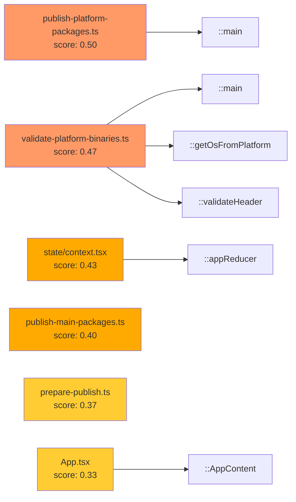

# Ising Self-Analysis: Analyzing Ising with Ising

**Date:** 2026-03-22
**Commit:** 2fcd797 (HEAD)
**Command:** `ising build --repo-path . --db ising-self.db --since "3 years ago"`

## Graph Summary

| Metric | Value |
|--------|-------|
| Nodes | 51 |
| Structural edges | 16 |
| Change edges | 0 |
| Defect edges | 0 |
| Cycles | 0 |
| Signals | 0 |

**Node breakdown:** 35 modules, 16 functions

All 16 edges are `structural/contains` (module → function containment).
No `imports`, `calls`, or `inherits` edges were detected — this is expected
because Ising's structural parser (tree-sitter) currently supports Python,
TypeScript, and JavaScript, and the **core Rust codebase is not yet parsed**.
Only the `ising-viz/`, `scripts/`, and `packages/` TypeScript/JavaScript
files are visible to the analyzer.

## Hotspot Rankings (Top 10)

| Rank | File | Score | Complexity | Freq |
|------|------|-------|------------|------|
| 1 | `scripts/publish-platform-packages.ts` | 0.50 | 15 | 1 |
| 2 | `scripts/validate-platform-binaries.ts` | 0.47 | 14 | 1 |
| 3 | `ising-viz/src/state/context.tsx` | 0.43 | 13 | 1 |
| 4 | `scripts/publish-main-packages.ts` | 0.40 | 12 | 1 |
| 5 | `scripts/prepare-publish.ts` | 0.37 | 11 | 1 |
| 6 | `ising-viz/src/App.tsx` | 0.33 | 10 | 1 |
| 7 | `scripts/validate-no-workspace-protocol.ts` | 0.27 | 8 | 1 |
| 8 | `scripts/generate-platform-manifests.ts` | 0.23 | 7 | 1 |
| 9 | `scripts/sync-versions.ts` | 0.23 | 7 | 1 |
| 10 | `scripts/add-platform-deps.ts` | 0.17 | 5 | 1 |

**Key finding:** The publishing scripts dominate the hotspot list due to
high cyclomatic complexity (many conditionals for platform detection,
error handling, and npm registry interactions). The viz state reducer
(`context.tsx`, complexity 13) is the most complex application code.

## Signals

**0 signals detected.** This is because:

1. **No change edges** — With only 3 commits in the git history and a
   `min_co_changes` threshold of 5, no file pairs met the coupling threshold.
   Ghost coupling, fragile boundary, and over-engineering signals all require
   change-layer data.
2. **No defect edges** — Layer 3 (defect graph) is not yet implemented.
3. **No cycles** — The structural graph is acyclic (all edges are simple
   containment).

## Structural Observations

### What Ising sees
- **35 TypeScript/JavaScript modules** across `ising-viz/`, `scripts/`, and `packages/`
- **16 contained functions** (named exports and top-level functions)
- All edges are `contains` (module → function); no cross-file `imports` or `calls` detected

### What Ising doesn't see (yet)
- **The entire Rust backend** (`ising-core`, `ising-builders`, `ising-analysis`,
  `ising-db`, `ising-cli`, `ising-server`) — ~25 `.rs` files with the core logic
- Cross-module TypeScript imports (the TS parser extracts functions but
  doesn't yet resolve `import` statements into graph edges)

### Highest-complexity modules

| File | Complexity | LOC |
|------|-----------|-----|
| `scripts/publish-platform-packages.ts` | 15 | 57 |
| `scripts/validate-platform-binaries.ts` | 14 | 75 |
| `ising-viz/src/state/context.tsx` | 13 | 85 |
| `scripts/publish-main-packages.ts` | 12 | 44 |
| `scripts/prepare-publish.ts` | 11 | 57 |
| `ising-viz/src/App.tsx` | 10 | 101 |

### Fan-out leaders (most dependencies)

| File | Fan-out |
|------|---------|
| `scripts/validate-platform-binaries.ts` | 3 |
| `scripts/generate-platform-manifests.ts` | 2 |
| All others | 1 |

## Mermaid Graph

## Recommendations

### For the Ising project itself

1. **Add Rust language support** (spec 019) — The biggest gap: Ising can't
   analyze its own core. Once the tree-sitter Rust grammar is integrated,
   the self-analysis will reveal the true dependency structure between
   `ising-core`, `ising-builders`, `ising-analysis`, etc.

2. **Improve TypeScript import resolution** — Currently only `contains` edges
   are extracted from TS files. Resolving `import` statements would reveal
   the actual dependency graph within `ising-viz/` (e.g., `App.tsx` imports
   from `state/context.tsx`, `views/*`, `components/*`).

3. **Lower `min_co_changes` for small repos** — The default threshold of 5
   filters out all coupling data for repos with few commits. An adaptive
   threshold (e.g., `min(5, total_commits / 2)`) would make the change
   graph useful for younger projects.

4. **Refactor publishing scripts** — The `scripts/` directory accounts for
   6 of the top 10 hotspots. These files have high complexity relative to
   their size. Consider extracting shared platform-detection and npm
   registry logic into a common utility.

### Meta-observations

The act of running Ising on itself reveals a classic bootstrapping insight:
**a tool's blind spots are most visible when applied to itself.** Ising's
current TypeScript-only structural parsing means it sees the periphery
(viz, scripts) but not the core (Rust engine). This mirrors a common pattern
in real codebases: the most critical code is often the least instrumented.

---

*Generated by running Ising v0.1.0 on its own repository.*
