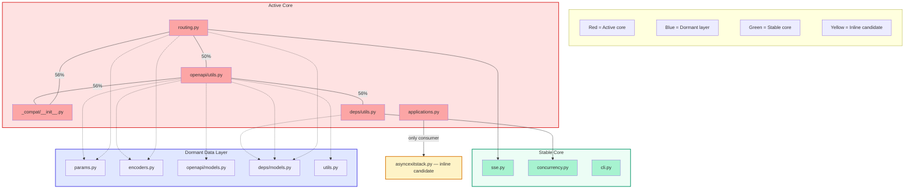
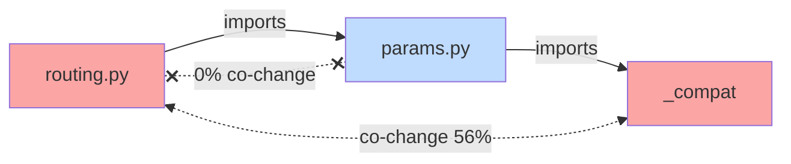

# FastAPI Validation — Signal Detection Findings & Improvement Roadmap

> **Status**: complete · **Priority**: high · **Created**: 2026-03-20

## Overview

Ising was run against **FastAPI** (a mature, well-structured open-source Python project) to validate the cross-layer signal detection engine on a real-world codebase. This spec documents the findings, visualizes the discovered architecture patterns, and identifies caveats and concrete improvements for the signal engine.

FastAPI is an ideal validation target: it has clear module boundaries, a significant git history, and known architectural patterns (routing core, compatibility layer, OpenAPI generation).

## Findings Summary

### Architecture Discovered

Ising identified three distinct architectural layers in FastAPI's `fastapi/` package:

### Signal Results

| Signal | Count | Key Findings |
|--------|-------|-------------|
| **Ghost Coupling** | ~4 pairs | `routing.py` ↔ `_compat/__init__.py` (56% co-change, no direct import). Hidden contract via shared version-compat logic. |
| **Over-Engineering** | 2 | `asyncexitstack.py` (18 lines, 1 class, single consumer `applications.py` — inline candidate). `forward_reference_type.py` (9 lines, test fixture — deliberate). |
| **Stable Core** | 4 modules | `sse.py`, `concurrency.py`, `cli.py`, `asyncexitstack.py` — all freq=1, high fan-in. Guard from churn. |
| **Pass-Through** | 9 edges | Active core imports dormant data layer (params, models, encoders) but 0% co-change between them. Data schemas are stable intermediaries. |
| **Fragile Boundary** | 0 | None detected — FastAPI's boundaries are healthy. |
| **Ticking Bomb** | 0 | None detected — no high-risk convergence of hotspot + defect + coupling. |

### Key Patterns Discovered

**1. Active Change Core (co-change 45–56%)**

Five files form the "beating heart" of FastAPI development. Changes to any one of these files have a >45% probability of requiring changes to one or more of the others:

- `routing.py` (freq: 39)
- `_compat/__init__.py` (freq: 9)
- `openapi/utils.py` (freq: 18)
- `dependencies/utils.py` (freq: 39)
- `applications.py` (freq: 20)

**2. Dormant Data Layer (0% co-change with core)**

Five files are heavily imported by the active core but never change together with it. They define stable data structures (Pydantic models, parameter types, encoders) that act as a "firewall" absorbing structural coupling without propagating change:

- `params.py`, `encoders.py`, `utils.py`
- `openapi/models.py`, `dependencies/models.py`

**3. Pass-Through Pattern (severity 0.28)**

`routing.py` imports `params.py` which imports `_compat`, but `routing.py` co-changes with `_compat` directly (56%) while never co-changing with `params.py`. The structural dependency chain doesn't match the change propagation path — the real coupling skips the intermediary.

**4. Single-Consumer Wrappers (severity 0.40)**

`asyncexitstack.py` (18 lines, 1 class) is only consumed by `applications.py`. This is a classic over-engineering signal: a tiny wrapper that could be inlined. The `forward_reference_type.py` case is a deliberate test fixture — correctly flagged but low priority.

## Caveats

### 1. File-Level Granularity Misses Intra-File Coupling

The change graph operates at file granularity (git tracks files, not functions). Two functions in the same file always have coupling=1.0 by definition. This means:
- **Large files appear artificially stable** — internal churn is invisible
- **Refactoring that splits a file creates false "ghost coupling"** — the new files will co-change (same logical unit) without structural edges until imports are added

**Mitigation**: Spec 010 (Multi-Granularity Graph) addresses this. Combine file-level change data with function-level structural data from Layer 1 for more precise signals.

### 2. Time Window Sensitivity

Results depend heavily on the `--since` window:
- **Too short** (1 month): Not enough co-change data, coupling scores are noisy
- **Too long** (2+ years): Old patterns dilute current architecture, dead code appears active
- **Refactoring epochs**: A major refactor within the window can dominate coupling scores, masking the steady-state architecture

**Mitigation**: Add temporal decay weighting — recent commits count more than old ones. Consider exponential decay: `weight = e^(-λ * age_days)` where λ is configurable.

### 3. Commit Size Bias

Large commits (merge commits, bulk renames, CI config changes) inflate co-change counts:
- A commit touching 50 files creates `50*49/2 = 1,225` co-change pairs
- The `max_files_per_commit` cap (default: 50) helps but is a blunt instrument

**Mitigation**: Already partially addressed by commit caps. Could improve with:
- Semantic commit classification (skip "chore:", "ci:", "docs:" prefixes)
- Proportional weighting: `1/num_files_in_commit` per co-change pair
- Exclude merge commits by default

### 4. Over-Engineering False Positives in Intentional Architecture

The over-engineering signal flags stable abstractions that exist for good architectural reasons:
- Re-export modules (`__init__.py`, `index.ts`) — already filtered
- Dependency injection interfaces — rarely change but exist for testability
- Protocol/trait definitions — used by many but never co-change with implementors

**Mitigation**: Allow `.isingignore` or `ising.toml` overrides to suppress known-good abstractions. Could also learn from git blame — if the file was created long ago and intentionally structured, reduce severity.

### 5. Ghost Coupling Can Be Legitimate

Not all ghost coupling is bad. Common legitimate cases:
- **Test files ↔ source files**: Tests co-change with source but may not import directly (framework imports the module)
- **Config files ↔ source**: Config changes accompany feature changes
- **Documentation ↔ source**: Docs update with features

**Mitigation**: Already filtering test↔source and config/docs. Could be more aggressive with heuristic path matching (e.g., `test_X.py` ↔ `X.py`).

### 6. No Defect Layer Validation

Layer 3 (Defect Graph) is not yet implemented. This means:
- **Fragile Boundary** signal is incomplete — it requires `fault_propagation > 0.1` which currently always evaluates to 0
- **Ticking Bomb** signal lacks `defect_density` data — only fires if hotspot and coupling alone are extreme
- The most valuable signal (fragile boundary) is effectively disabled

**Mitigation**: Implement heuristic defect detection (spec 007 fallback): scan commit messages for "fix", "bug", "hotfix", "revert" patterns. This is less accurate than issue tracker integration but enables all five signals immediately.

### 7. Language-Specific Import Resolution Gaps

Tree-sitter parsing doesn't fully resolve imports:
- **Python relative imports** (`from . import X`) — recently fixed but edge cases remain
- **Re-exports and barrel files** — structural graph may miss the transitive dependency
- **Dynamic imports** (`importlib.import_module()`) — invisible to static analysis
- **TypeScript path aliases** (`@/components/X`) — not resolved without tsconfig parsing

**Mitigation**: For MVP, accept these gaps and document them. Long-term, integrate with SCIP (already built in `ising-scip`) for higher-fidelity import resolution.

## Improvements

### Priority 1 — Signal Engine Accuracy

| Improvement | Impact | Effort |
|-------------|--------|--------|
| **Temporal decay weighting** — exponential decay on commit age | Eliminates stale coupling from old refactors | Medium |
| **Proportional co-change** — weight by `1/commit_size` | Reduces large-commit bias | Low |
| **Heuristic defect layer** — commit message scanning for bug-fix patterns | Enables fragile_boundary and ticking_bomb signals | Medium |
| **Semantic commit filtering** — skip chore/ci/docs commits | Reduces noise in coupling scores | Low |

### Priority 2 — Signal Presentation

| Improvement | Impact | Effort |
|-------------|--------|--------|
| **Mermaid export for signals** — `ising export --format mermaid` with signal overlays | Visual architecture maps directly from CLI | Low (export module exists) |
| **Severity calibration** — normalize severity scores to [0,1] with consistent meaning | Makes `--min-severity` intuitive across signal types | Medium |
| **Signal grouping** — cluster related signals (e.g., all ghost couplings involving `routing.py`) | Reduces noise, surfaces patterns | Low |
| **Diff-aware signals** — `ising diff` shows only NEW signals since last build | CI integration: fail on new ticking_bomb or fragile_boundary | Medium |

### Priority 3 — Scalability

| Improvement | Impact | Effort |
|-------------|--------|--------|
| **Incremental builds** — only reparse changed files since last `ising build` | 10x faster for large repos on repeat runs | High |
| **Directory-level aggregation** — aggregate signals to module/package level | Actionable for architects, not just developers | Medium (spec 010) |
| **Parallel signal detection** — run each signal detector in parallel via rayon | Faster analysis for large graphs | Low |
| **Streaming git log** — process commits as a stream instead of collecting all into memory | Reduces memory for 100k+ commit repos | Medium |

### Priority 4 — Validation & Trust

| Improvement | Impact | Effort |
|-------------|--------|--------|
| **Benchmark suite** — run Ising on 5+ well-known OSS repos (Django, Express, Tokio, etc.) | Validates signal accuracy across ecosystems | Medium |
| **Ground truth comparison** — compare ghost coupling findings against actual bug-fix PRs | Proves the "hidden dependency" thesis empirically | High |
| **Signal precision/recall** — for over-engineering, manually label true/false positives in 3 repos | Tunes thresholds with data, not intuition | Medium |

## Test

- [x] Ising `build` completes on FastAPI without errors
- [x] Ghost coupling detected between `routing.py` and `_compat/__init__.py`
- [x] Over-engineering correctly identifies `asyncexitstack.py` as inline candidate
- [x] Stable core correctly identifies low-churn, high-fan-in modules
- [x] Pass-through pattern detected via over-engineering signal variant
- [x] No false fragile_boundary or ticking_bomb signals (no defect data)
- [ ] Temporal decay weighting improves signal stability across different `--since` windows
- [ ] Heuristic defect layer enables fragile_boundary detection on at least 1 real repo
- [ ] Benchmark suite passes on 5+ repos without crashes or timeouts

## Notes

- FastAPI was chosen because Tiangolo maintains clean architecture — the absence of fragile_boundary and ticking_bomb signals is itself a validation (true negatives)
- The "dormant data layer" pattern is likely common in well-designed frameworks: stable schemas absorbed into a thin data layer that insulates the active logic core
- The pass-through signal is a novel finding not described in Tornhill's work — it captures a mismatch between structural dependency chains and actual change propagation paths
- Next validation target should be a less well-maintained repo to test positive signal detection (fragile boundaries, ticking bombs)
