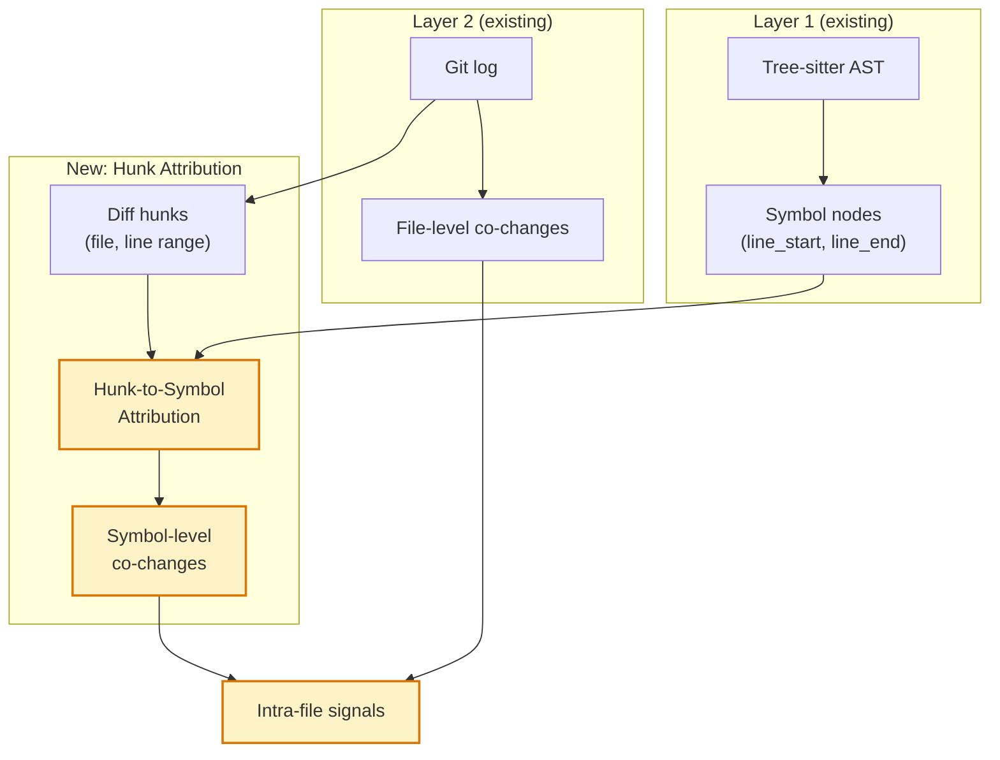

# Intra-File Coupling Detection

> **Status**: draft · **Priority**: high · **Created**: 2026-03-20

## Overview

Spec 011 (FastAPI Validation) identified **Caveat 1: File-Level Granularity Misses Intra-File Coupling** as a fundamental limitation of the signal engine. The change graph (Layer 2) operates at file granularity because git tracks files, not functions. This creates two blind spots:

1. **Large files appear artificially stable** — internal churn across functions is invisible because the file is always coupling=1.0 with itself.
2. **File splits create false ghost coupling** — when a large file is refactored into two files, the new files co-change (same logical unit) without structural edges, producing a spurious ghost coupling signal until imports are added.

This spec bridges the gap by combining Layer 1's symbol-level structural data (function/class nodes with line ranges from tree-sitter) with Layer 2's file-level git history to synthesize **function-level change attribution** without requiring function-level git tracking.

## Design

### Core Idea: Hunk-to-Symbol Attribution

Git diffs contain **hunks** — contiguous ranges of changed lines. Layer 1 already stores **function/class nodes with `line_start` and `line_end`**. By overlapping hunk ranges with symbol ranges, we can attribute each changed line to the function or class that contains it.

```
Git diff hunk: lines 42–58 changed in routing.py
Layer 1 symbols:
  routing.py::add_api_route       lines 30–55
  routing.py::include_router      lines 57–80

→ Attribution:
  routing.py::add_api_route  — 14 lines changed (42–55)
  routing.py::include_router —  2 lines changed (57–58)
```

This transforms file-level co-change data into **symbol-level co-change data** for intra-file analysis.

### Architecture



### Data Flow

1. **Hunk extraction** — For each commit in the time window, extract diff hunks with line ranges (using gix diff, already available). Output: `Vec<(CommitId, FilePath, LineRange)>`.

2. **Symbol map construction** — From Layer 1, build an interval map per file: `HashMap<FilePath, IntervalTree<u32, SymbolId>>`. Each symbol's `[line_start, line_end]` range becomes an interval. This enables O(log n) lookup of which symbol(s) a changed line belongs to.

3. **Hunk attribution** — For each hunk, query the interval tree to find overlapping symbols. Attribute changed lines proportionally when a hunk spans multiple symbols. Lines outside any symbol range are attributed to the file-level module node.

4. **Symbol-level co-change** — Within each commit, after attribution, compute co-changes at the symbol level: if symbol A and symbol B (in the same file) both have attributed changes in the same commit, record a co-change. Apply the same thresholds as file-level co-change (`min_co_changes`, `min_coupling`).

5. **Intra-file edge creation** — Add `CoChanges` edges between symbols within the same file when coupling exceeds the threshold. These edges are tagged with metadata `{"scope": "intra_file"}` to distinguish them from file-level co-changes.

### New Signals

#### Intra-File Hotspot

A function that changes far more often than its siblings in the same file, indicating the file's apparent stability masks a localized hotspot.

```
For each file F with symbols [s1, s2, ..., sN]:
    mean_freq = avg(change_freq(si))
    if change_freq(si) > 3 × mean_freq && change_freq(si) >= 5:
        Signal::IntraFileHotspot(si, severity = change_freq(si) / mean_freq)
```

**Actionable insight**: Extract the volatile function into its own module, or investigate why it changes so often relative to its neighbors.

#### Hidden Intra-File Coupling

Two functions in the same file that always co-change but have no call/reference relationship within the file (intra-file ghost coupling).

```
For symbols A, B in same file:
    if intra_coupling(A, B) > 0.5 && !has_contains_or_calls_edge(A, B):
        Signal::HiddenIntraFileCoupling(A, B, severity = intra_coupling)
```

**Actionable insight**: The functions share a hidden contract (shared state, implicit ordering, copy-pasted logic). Consider making the dependency explicit or extracting a shared abstraction.

#### File Split Candidate

A file where distinct clusters of functions co-change independently — suggesting the file contains multiple logical modules.

```
For each file F with symbols [s1, ..., sN]:
    Build intra-file co-change matrix M (N×N)
    Compute connected components at coupling threshold 0.3
    if num_components >= 2 && min_component_size >= 2:
        Signal::FileSplitCandidate(F, components, severity = 1 - modularity(M))
```

**Actionable insight**: The file bundles unrelated concerns. Each cluster could be its own module.

### Handling Line Drift

Symbol line ranges come from the **current** tree-sitter parse (HEAD), but hunks reference **historical** line numbers. Over many commits, functions move as lines are added/removed above them.

**Pragmatic approach**: Use the current symbol map for all commits. This introduces some attribution noise for old commits where functions have moved significantly, but:
- Recent commits (which matter most) have minimal drift
- Temporal decay weighting (spec 011 improvement) naturally reduces old-commit influence
- Perfect historical attribution would require re-parsing every historical revision, which is prohibitively expensive

**Future improvement**: For high-accuracy mode, cache symbol maps at periodic snapshots (e.g., every 100 commits) and use the nearest snapshot for attribution.

### Configuration

Add to `ising.toml` / CLI:

```toml
[change]
intra_file_coupling = true          # Enable intra-file analysis (default: false for MVP)
min_symbols_per_file = 3            # Skip files with fewer symbols (not enough to be interesting)
intra_min_co_changes = 3            # Lower threshold than file-level (less data per symbol)
intra_min_coupling = 0.4            # Slightly higher threshold to reduce noise
```

## Plan

- [ ] Add hunk extraction to `ising-builders/src/change.rs` — extend `walk_commits` to optionally collect `(file, line_start, line_end)` per hunk
- [ ] Create `ising-builders/src/attribution.rs` — interval tree construction from Layer 1 symbols, hunk-to-symbol mapping logic
- [ ] Implement symbol-level co-change computation in attribution module — reuse existing coupling formula with configurable thresholds
- [ ] Add `CoChanges` edges with `intra_file` scope metadata to `UnifiedGraph` during merge
- [ ] Implement `IntraFileHotspot` signal in `ising-analysis/src/signals.rs`
- [ ] Implement `HiddenIntraFileCoupling` signal in `ising-analysis/src/signals.rs`
- [ ] Implement `FileSplitCandidate` signal with connected component detection
- [ ] Add `intra_file_coupling` config option to `ising-core/src/config.rs`
- [ ] Extend `ising-db` schema: add `scope` column to edges table, add new signal types
- [ ] Unit tests: hunk attribution accuracy with known symbol ranges
- [ ] Integration test: run on FastAPI, verify `routing.py` intra-file signals make sense

## Test

- [ ] Hunk `(file.py, 42, 58)` correctly attributes to symbols with overlapping `[line_start, line_end]`
- [ ] Lines outside any symbol range are attributed to the module node
- [ ] Symbol co-change within a file produces `CoChanges` edges with `intra_file` metadata
- [ ] `IntraFileHotspot` fires for a function with 5x the average change frequency in its file
- [ ] `HiddenIntraFileCoupling` fires for two co-changing functions with no structural edge
- [ ] `FileSplitCandidate` fires for a file with 2+ independent co-change clusters
- [ ] No false `FileSplitCandidate` for files where all functions co-change together
- [ ] Performance: intra-file analysis adds <20% overhead to `ising build` on FastAPI-sized repos
- [ ] FastAPI `routing.py` (39 commits, high complexity) produces at least one intra-file signal

## Notes

- **Relationship to spec 010**: Spec 010 aggregates the graph *upward* (symbol → file → directory → package). This spec pushes change data *downward* (file-level co-change → symbol-level co-change). They are complementary — spec 010 provides the aggregation framework, this spec provides the fine-grained data to aggregate from.
- **Why not parse every historical revision?** Re-running tree-sitter on every commit in the window would give perfect symbol attribution but is O(commits × files) in parse time. For FastAPI's 5000-commit window that's ~250k parses. The hunk-overlap heuristic with HEAD symbol map is O(commits × hunks) with minimal overhead.
- **Interval tree crate**: Consider `rust_lapper` or `coitrees` for the interval tree — both are zero-copy and designed for genomic range queries, which is the same overlapping-intervals problem.
- **Ghost coupling refinement**: With intra-file coupling data, we can suppress false ghost coupling signals that arise from file splits. If two new files contain symbols that were previously in the same file (detectable via git log rename tracking), reduce ghost coupling severity.
