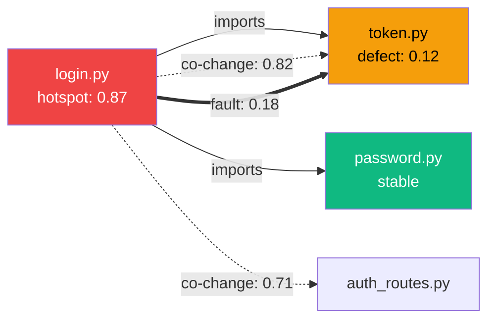

# V2: Blast Radius Graph

> **Status**: planned · **Priority**: high · **Created**: 2026-03-20

## Overview

The blast radius view answers "If I change this file, what breaks?" — a force-directed graph showing structural, temporal, and defect dependencies radiating from a selected node across all three analysis layers. The core value is **layer comparison**: toggling layers on/off reveals ghost coupling (amber edges without structural edges) and fragile boundaries (all three edge types between the same pair).

## Design

### Graph Construction

1. Start with `selectedNode` as center
2. Collect all edges (across all 3 layers) where `source == selectedNode OR target == selectedNode` → 1st-hop neighbors
3. For each 1st-hop neighbor, collect their edges within the existing node set → 2nd-hop connections (not new nodes beyond 1st hop by default)
4. Depth configurable: `depth = 1 | 2 | 3` (default: 2)
5. Max nodes cap: 50. For large neighborhoods, show top-N by combined edge weight. Graceful degradation.

The BFS neighborhood extraction is implemented in `utils/graph.ts`.

### Layout

Force-directed via `d3-force`. Center node is pinned at the canvas center. Simulation parameters:

- `forceLink` with distance proportional to `1 / weight`
- `forceCharge` with `strength(-200)` for node repulsion
- `forceCenter` to keep the graph centered
- `alphaDecay(0.05)` for fast settling (~300ms)

### Node Encoding

| Channel       | Encodes                                                          |
|---------------|------------------------------------------------------------------|
| Circle radius | `sqrt(LOC) * scale` (center node gets fixed larger radius)       |
| Fill color    | Module color (categorical)                                       |
| Stroke        | White 2px ring = center node. Dashed ring = has active signal    |
| Label         | Filename (below node, truncated if overlap)                      |
| Opacity       | 1.0 for center + 1st hop, 0.6 for 2nd hop                       |

### Edge Encoding

| Layer      | Stroke style     | Color              | Width            |
|------------|------------------|--------------------|------------------|
| Structural | Solid line       | `#94a3b8` (slate)  | 1.5px            |
| Change     | Long dash `6,3`  | `#f59e0b` (amber)  | `weight * 3` px  |
| Defect     | Short dash `3,3` | `#ef4444` (red)    | `weight * 4` px  |

### Layer Toggle

Three toggle buttons in the toolbar. Each layer can be independently shown/hidden. This is the core cross-layer comparison mechanism:

- Show only Structural → see code dependencies
- Show only Change → see temporal coupling
- Show both → see ghost coupling (amber edges without a slate edge between same nodes)
- Show all three → see full risk picture

Toggling a layer animates its edges in/out (opacity transition) and re-runs the force simulation (link forces change when edges are removed).

### Interactions

| Action             | Result                                               |
|--------------------|------------------------------------------------------|
| Hover edge         | Tooltip: layer, type, weight, detail                 |
| Hover node         | Tooltip: file metrics                                |
| Click node         | Re-center graph on clicked node (becomes new center) |
| Drag node          | Move node, force simulation adjusts                  |
| Layer toggle       | Animate edges in/out                                 |
| Depth slider (1-3) | Rebuild neighborhood, animate transition             |

### Signal Highlighting

When a signal involves the center node, highlight the relevant edge:

- `fragile_boundary(A, B)` → the edge between A and B gets a red glow + pulsing CSS animation
- `ghost_coupling(A, B)` → special amber dashed edge with ghost icon at midpoint
- `ticking_bomb(A)` → center node gets red pulsing ring

### Text Serialization

```
ising impact src/auth/login.py --depth 2 --format text
```

Output:

```
Center: src/auth/login.py
  Complexity: 42 | LOC: 380 | Hotspot: 0.87

Structural (fan-out: 5):
  → src/db/user_store.py        [imports: get_user, update_user]
  → src/auth/token.py           [imports: generate_jwt]
  → src/auth/password.py        [calls: verify_hash]
  → src/middleware/rate_limit.py [imports: check_rate]
  → src/events/audit.py         [calls: log_event]

Temporal (co-change > 0.3):
  ↔ src/auth/token.py           coupling: 0.82
  ↔ src/api/v2/auth_routes.py   coupling: 0.71

Fault Propagation:
  → src/auth/token.py           probability: 0.18

Signals:
  [CRITICAL] fragile_boundary → token.py  (severity: 0.92)
  [HIGH]     ghost_coupling ↔ auth_routes.py  (severity: 0.78)
```

### Mermaid Serialization

```
ising impact src/auth/login.py --format mermaid
```

Output:



Rules:
- Max 15 nodes in Mermaid output (readability limit)
- Node labels include filename + most important metric
- `-->` for structural, `-.->` for change, `==>` for defect

### Component Structure

```
BlastRadius.tsx
├── Force simulation (d3-force, computed in useEffect)
├── SVG container
│   ├── EdgeGroup (per edge)
│   │   ├── Line/path with layer-specific styling
│   │   └── Signal highlight overlay (conditional)
│   ├── NodeGroup (per node)
│   │   ├── Circle (fill, stroke, opacity)
│   │   ├── Label (filename)
│   │   └── Signal ring (conditional)
│   └── EdgeTooltip / NodeTooltip (on hover)
└── LayerToggle.tsx + DepthSlider (toolbar)
```

## Plan

- [ ] Implement `views/BlastRadius.tsx` — main force-directed graph container
- [ ] Implement neighborhood extraction using `utils/graph.ts` BFS with depth and node cap
- [ ] Set up d3-force simulation with forceLink, forceCharge, forceCenter, alphaDecay
- [ ] Render SVG circles for nodes with module-colored fill and size proportional to sqrt(LOC)
- [ ] Render SVG lines/paths for edges with layer-specific stroke style, color, and width
- [ ] Implement layer toggle buttons — animate edges in/out, re-run simulation
- [ ] Implement depth slider (1-3) — rebuild neighborhood on change
- [ ] Implement click-to-recenter — clicked node becomes new center, graph rebuilds
- [ ] Implement node dragging with force simulation adjustment
- [ ] Implement hover tooltips for nodes (file metrics) and edges (layer, type, weight)
- [ ] Implement signal highlighting — pulsing edges for fragile_boundary, ghost icons for ghost_coupling, red ring for ticking_bomb
- [ ] Implement `LayerToggle.tsx` component for toolbar
- [ ] Implement graceful degradation: top-N neighbors by combined weight when > 50 nodes

## Test

- [ ] Graph renders center node pinned at canvas center with correct module color
- [ ] 1st-hop neighbors appear at full opacity; 2nd-hop at 0.6
- [ ] Structural edges render as solid slate lines; change as amber dashed; defect as red dashed
- [ ] Edge width scales with weight for change and defect layers
- [ ] Toggling a layer off hides its edges and re-runs simulation
- [ ] Ghost coupling is visible: amber edge between nodes with no slate edge
- [ ] Fragile boundary is visible: all three edge types between same node pair
- [ ] Clicking a non-center node makes it the new center
- [ ] Depth slider at 1 shows only direct neighbors; at 3 shows 3-hop neighborhood
- [ ] Node cap of 50 is respected — extra nodes pruned by combined edge weight
- [ ] Signal highlighting: fragile_boundary edge pulses red, ticking_bomb center ring pulses
- [ ] Force simulation settles within 300ms (alphaDecay 0.05)
- [ ] Mermaid output produces valid Mermaid syntax with max 15 nodes

## Notes

- D3 force simulation runs in `useEffect` and updates node positions via `useState`. React re-renders SVG elements. This avoids D3 DOM manipulation conflicting with React's virtual DOM.
- The 50-node cap is critical for readability. Force-directed layouts degrade rapidly beyond ~50 nodes. For larger neighborhoods, the top-N pruning by combined edge weight preserves the most important relationships.
- Ghost coupling is the most important cross-layer insight. It should be visually unmistakable: an amber dashed edge between two nodes with no solid gray edge. Consider adding a small ghost icon at the midpoint.
- Re-centering on click triggers a full neighborhood rebuild, not just a layout adjustment. This ensures the depth boundary is always relative to the center node.
