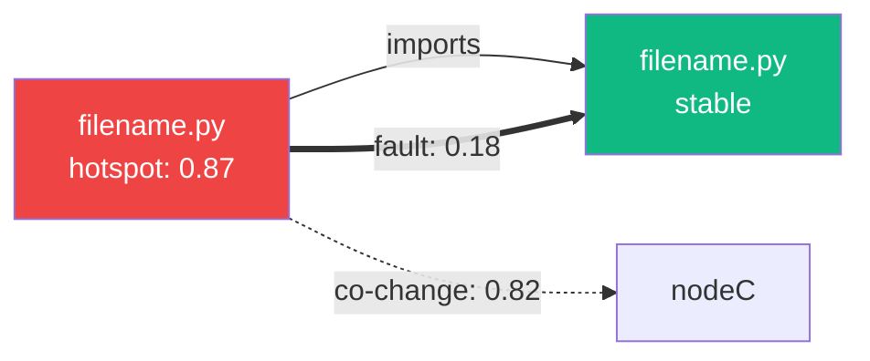

# Agent-Compatible Output Formats

> **Status**: planned · **Priority**: medium · **Created**: 2026-03-20

## Overview

AI coding agents need structured, serializable graph fragments they can render inline or consume as context. This spec adds three output formats to existing CLI commands and MCP tools: **Mermaid** (for inline rendering in chat), **structured JSON** (for agent context injection), and **ASCII table** (for CLI readability).

Every view in the visualization SPA has a text-serializable equivalent. If it can't be serialized, it's a Phase 2 feature.

## Design

### Format Support Matrix

| Command / MCP Tool   | `--format table` | `--format text` | `--format mermaid` | `--format json` |
|----------------------|-------------------|-----------------|---------------------|-----------------|
| `ising hotspots`     | Yes (default)     | —               | —                   | Yes             |
| `ising impact <file>`| —                 | Yes (default)   | Yes                 | Yes             |
| `ising signals`      | Yes (default)     | —               | —                   | Yes             |
| MCP `ising_impact`   | —                 | —               | Yes                 | Yes (default)   |
| MCP `ising_signals`  | —                 | —               | —                   | Yes (default)   |
| MCP `ising_hotspots` | —                 | —               | —                   | Yes (default)   |

### 1. Mermaid Format

Used by `ising impact --format mermaid` and MCP `ising_impact` tool. Produces a Mermaid `graph LR` diagram representing the blast radius.

**Template**:



**Rules**:
- Max 15 nodes (readability limit). If neighborhood exceeds 15, prune by combined edge weight.
- Node labels include filename + most important metric or signal icon
- Node IDs are sanitized filenames (alphanumeric + underscores)
- `-->` for structural, `-.->` for change, `==>` for defect
- Node fill color: red for hotspot > 0.7, amber for 0.4-0.7, green for stable_core, default gray

### 2. Structured JSON (Agent Context)

Used by MCP tools. Agents receive this and decide what to include in their context window.

**Impact response**:

```jsonc
{
  "center": "src/auth/login.py",
  "risk_level": "critical",           // critical | high | medium | low
  "summary": "High hotspot (0.87), 4 bugs in 6 months, fragile boundary with token.py",
  "metrics": {
    "loc": 380,
    "complexity": 42,
    "hotspot": 0.87,
    "churn_rate": 2.3,
    "bug_count": 4,
    "fan_in": 3,
    "fan_out": 5
  },
  "blast_radius": {
    "structural": ["src/db/user_store.py", "src/auth/token.py"],
    "temporal": ["src/auth/token.py", "src/api/v2/auth_routes.py"],
    "defect": ["src/auth/token.py"]
  },
  "signals": [
    {
      "type": "fragile_boundary",
      "target": "src/auth/token.py",
      "severity": 0.92,
      "detail": "Structural dep + co-change 0.82 + fault propagation 0.18."
    }
  ],
  "recommendation": "Review token.py after any change. Consider refactoring auth_routes.py dependency."
}
```

**Risk level derivation**:
- `critical` — hotspot > 0.8 OR any ticking_bomb signal
- `high` — hotspot > 0.6 OR any fragile_boundary signal
- `medium` — hotspot > 0.3 OR any ghost_coupling signal
- `low` — everything else

**Signals response**:

```jsonc
{
  "total": 28,
  "by_type": {
    "ticking_bomb": 2,
    "fragile_boundary": 5,
    "ghost_coupling": 8,
    "over_engineering": 3,
    "stable_core": 10
  },
  "signals": [
    {
      "type": "fragile_boundary",
      "node_a": "src/auth/login.py",
      "node_b": "src/auth/token.py",
      "severity": 0.92,
      "detail": "..."
    }
  ]
}
```

### 3. ASCII Table (CLI)

Used by `ising hotspots` and `ising signals` as their default output format.

**Hotspots table**:

```
Rank  File                        Hotspot  Complexity  Churn  Bugs
1     src/auth/login.py           0.87     42          2.3    4
2     src/auth/token.py           0.72     28          1.8    5
3     src/api/v2/auth_routes.py   0.65     31          1.5    2
```

**Signals table**:

```
TYPE               NODE_A              NODE_B              SEVERITY
─────────────────────────────────────────────────────────────────────
ticking_bomb       auth/login.py       -                   0.95
ticking_bomb       auth/token.py       -                   0.85
fragile_boundary   auth/login.py       auth/token.py       0.92
fragile_boundary   auth/oauth.py       auth/token.py       0.71
ghost_coupling     auth/login.py       events/notif...     0.78
```

**Impact text**:

```
Center: src/auth/login.py
  Complexity: 42 | LOC: 380 | Hotspot: 0.87

Structural (fan-out: 5):
  → src/db/user_store.py        [imports: get_user, update_user]
  → src/auth/token.py           [imports: generate_jwt]

Temporal (co-change > 0.3):
  ↔ src/auth/token.py           coupling: 0.82
  ↔ src/api/v2/auth_routes.py   coupling: 0.71

Fault Propagation:
  → src/auth/token.py           probability: 0.18

Signals:
  [CRITICAL] fragile_boundary → token.py  (severity: 0.92)
  [HIGH]     ghost_coupling ↔ auth_routes.py  (severity: 0.78)
```

### CLI Flag Design

```
--format <table|text|mermaid|json>   Output format (default varies by command)
--top <N>                            Limit results (for hotspots, default: 10)
--depth <1|2|3>                      Blast radius depth (for impact, default: 2)
--min-severity <0.0-1.0>            Filter signals (for signals, default: 0.0)
```

### MCP Tool Updates

Extend existing MCP tool responses to include the structured JSON format. MCP tools always return JSON but should include the `mermaid` field when explicitly requested or when the agent's context suggests inline rendering.

## Plan

- [ ] Define format output types in `ising-cli/src/format.rs` — trait for each format with implementations per command
- [ ] Implement Mermaid serializer — node sanitization, edge type mapping, 15-node cap, fill color logic
- [ ] Implement structured JSON impact response — risk level derivation, blast radius grouping, recommendation text
- [ ] Implement structured JSON signals response — grouping by type, counts
- [ ] Implement ASCII table formatter — column alignment, path truncation, separator lines
- [ ] Implement ASCII text impact formatter — indented sections per layer
- [ ] Add `--format` flag to `ising hotspots`, `ising impact`, `ising signals` commands
- [ ] Add `--top`, `--depth`, `--min-severity` flags to respective commands
- [ ] Extend MCP `ising_impact` tool to accept `format` parameter and return Mermaid when requested
- [ ] Extend MCP `ising_signals` and `ising_hotspots` tools with structured JSON responses
- [ ] Generate recommendation text from signal + metric data

## Test

- [ ] `ising hotspots --format table` produces aligned columns with correct values
- [ ] `ising hotspots --top 5` limits output to 5 rows
- [ ] `ising impact <file> --format mermaid` produces valid Mermaid syntax
- [ ] Mermaid output caps at 15 nodes even for large neighborhoods
- [ ] Mermaid node IDs are valid (alphanumeric + underscore, no special chars)
- [ ] `ising impact <file> --format json` includes risk_level, blast_radius, signals, recommendation
- [ ] Risk level derivation: hotspot 0.9 → critical, hotspot 0.5 → medium
- [ ] `ising signals --min-severity 0.5 --format table` filters out low-severity signals
- [ ] `ising signals --format json` includes by_type counts matching signal list
- [ ] ASCII table truncates long paths with `...` at column width
- [ ] MCP `ising_impact` returns Mermaid field when `format: "mermaid"` is passed
- [ ] All format outputs are deterministic (same input → same output, for diffing)

## Notes

- Mermaid is the key agent format — most AI chat interfaces render Mermaid inline, giving agents a visual way to communicate graph structure to users.
- The 15-node cap for Mermaid is a hard limit based on readability testing. Mermaid diagrams with more nodes become unreadable in chat windows.
- Recommendation text is generated from a simple rule engine (signal type + severity → template). It is intentionally opinionated but not prescriptive.
- The `--format` flag follows the convention of tools like `kubectl` and `gh`. Default format varies by command to give the best experience for each use case.
- Future: add `--format svg` that renders the blast radius graph server-side and returns an SVG image (useful for embedding in GitHub PR comments).
