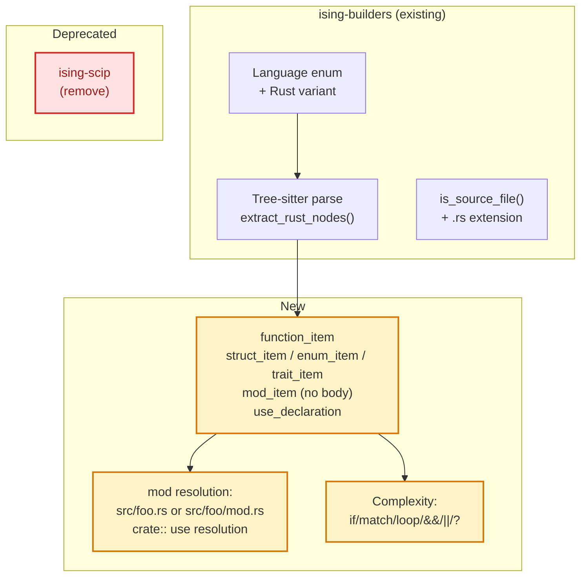

# Rust Language Support

> **Status**: draft · **Priority**: high · **Created**: 2026-03-20

## Overview

Ising currently supports Python, TypeScript, and JavaScript for structural analysis (Layer 1) via Tree-sitter. Rust projects cannot be analyzed — `.rs` files are invisible to both the structural graph builder and the change graph builder.

This spec adds first-class Rust support via Tree-sitter and deprecates the `ising-scip` crate, which was built to solve precise symbol resolution via external SCIP indexes. Tree-sitter structural analysis is simpler, requires no external tooling, and has proven sufficient for signal detection in FastAPI validation (spec 011). SCIP's complexity is not worth the maintenance burden.

## SCIP Deprecation

The `ising-scip` crate (`ising-scip/src/lib.rs`) is marked **deprecated** and will be removed. Reasons:

- Requires users to run an external indexer (`rust-analyzer scip .`, `scip-typescript`, etc.) before running `ising build`
- Adds a protobuf dependency and significant parse/load complexity for marginal signal accuracy improvement
- Tree-sitter structural analysis has proven sufficient for all five signals across Python and TypeScript
- SCIP is not referenced by any current `ising build` code path — it was built speculatively and never integrated into the signal pipeline

**Removal plan**: Mark `ising-scip` as deprecated in this spec. Remove the crate and its workspace entry in a follow-up cleanup PR once spec 019 implementation is merged.

## Design

### Layer 1: Structural Graph

#### Rust-Specific Node Types

Rust's module system differs from Python/TypeScript. The key node types to extract:

| Tree-sitter node | Ising concept | Notes |
|---|---|---|
| `function_item` | Function | Top-level `fn` declarations |
| `impl_item` + method → `function_item` | Function | Methods on `impl` blocks, attributed to the impl type |
| `struct_item` | Class | Struct definitions |
| `enum_item` | Class | Enum definitions (often carry logic via `match`) |
| `trait_item` | Class | Trait definitions (interface analog) |
| `use_declaration` | Import | `use` statements for intra-crate resolution |
| `mod_item` with body | — | Inline modules (skip — not separate files) |
| `mod_item` without body | Import | `mod foo;` declarations → edge to `src/foo.rs` or `src/foo/mod.rs` |

#### Method Attribution

Rust methods live inside `impl` blocks, not directly in the file scope. The tree-sitter grammar represents this as:

```
source_file
  impl_item        (impl MyStruct)
    declaration_list
      function_item  (fn method_name)
```

Ising will attribute methods to their `impl` type name, producing node IDs like `src/lib.rs::MyStruct::method_name`. The impl block itself is not added as a separate node — it's a grouping mechanism, not a unit of abstraction.

This mirrors how Python handles class methods (`module::ClassName::method_name`).

#### Import Resolution

Rust's import model is crate-relative, not file-relative. Two sources of intra-crate edges:

1. **`mod foo;` declarations** — explicit module declarations create a parent→child edge. Resolution:
   - `src/lib.rs` contains `mod foo;` → edge to `src/foo.rs` or `src/foo/mod.rs`
   - `src/bar/mod.rs` contains `mod baz;` → edge to `src/bar/baz.rs` or `src/bar/baz/mod.rs`

2. **`use crate::foo::bar` statements** — intra-crate `use` items. Resolution:
   - Strip `crate::` prefix
   - Map path components to file system: `foo::bar` → `src/foo/bar.rs` or `src/foo/bar/mod.rs`
   - If path resolves to a known module ID in the graph, add an `Imports` edge

Ignore external crate imports (`use std::`, `use serde::`, etc.) — they have no node in the graph.

#### Complexity for Rust

Cyclomatic complexity decision points in Rust:

| Tree-sitter node | Reason |
|---|---|
| `if_expression` | Conditional branch |
| `if_let_expression` | Pattern-matching conditional |
| `match_arm` | Each match arm is a branch |
| `for_expression` | Loop |
| `while_expression` | Loop |
| `while_let_expression` | Pattern-matching loop |
| `loop_expression` | Unconditional loop (exit via `break`) |
| `&&` / `\|\|` in `binary_expression` | Logical branching |
| `?` operator (`try_expression` / `error_propagation_expression`) | Early return path |

Base complexity = 1 + count of above.

### Layer 2: Change Graph

The `is_source_file` filter in `ising-builders/src/change.rs` must include `.rs`:

```rust
Some("py" | "ts" | "tsx" | "js" | "jsx" | "rs")
```

This enables co-change and coupling analysis for Rust files in git history.

### Architecture



## Plan

- [ ] Add `tree-sitter-rust` to `[workspace.dependencies]` in root `Cargo.toml`
- [ ] Add `tree-sitter-rust` to `[dependencies]` in `ising-builders/Cargo.toml`
- [ ] Add `Language::Rust` variant to `Language` enum in `structural.rs`
  - `from_extension`: `"rs"` → `Language::Rust`
  - `name()`: returns `"rust"`
  - `get_tree_sitter_language()`: returns `tree_sitter_rust::LANGUAGE.into()`
- [ ] Implement `extract_rust_nodes()` in `structural.rs`
  - Walk top-level `source_file` children for `function_item`, `struct_item`, `enum_item`, `trait_item`, `impl_item`, `use_declaration`, `mod_item`
  - For `impl_item`: walk its `declaration_list` for nested `function_item` nodes, prefix names with `ImplType::`
  - For `use_declaration`: resolve `crate::` paths to file paths
  - For `mod_item` without body: resolve to `sibling/foo.rs` or `sibling/foo/mod.rs`
- [ ] Implement `compute_complexity` for `Language::Rust` — count decision points listed above
- [ ] Add `"rs"` to `is_source_file()` in `change.rs`
- [ ] Add import resolution logic for Rust `mod` and `use crate::` paths (analogous to `resolve_python_import`)
- [ ] Mark `ising-scip` as `#[deprecated]` in `ising-scip/src/lib.rs` with a doc comment
- [ ] Integration test: run `ising build` on the ising repo itself (a Rust project), verify node/edge counts are reasonable
- [ ] Unit tests: `extract_rust_nodes` on sample Rust source with functions, structs, enums, impl blocks, use statements

## Test

- [ ] `.rs` files appear in `walk_source_files` output with `Language::Rust`
- [ ] `function_item` at file scope → `Function` node with correct `line_start` / `line_end`
- [ ] `impl MyStruct { fn method() {} }` → `Function` node ID `file.rs::MyStruct::method`
- [ ] `struct_item` → `Class` node; `enum_item` → `Class` node; `trait_item` → `Class` node
- [ ] `mod foo;` in `src/lib.rs` → `Imports` edge to `src/foo.rs` (if that module node exists)
- [ ] `use crate::bar::baz` → `Imports` edge to `src/bar/baz.rs` (if exists)
- [ ] `use std::collections::HashMap` → no edge added (external crate)
- [ ] Complexity: function with one `if` and one `match` with 3 arms → complexity = 1 + 1 + 3 = 5
- [ ] `is_source_file("src/main.rs")` returns `true`
- [ ] `ising build` on the ising repo itself completes without error and produces >50 nodes
- [ ] Change graph for a Rust repo includes `.rs` files in co-change analysis

## Notes

- **Why not SCIP?** SCIP gives exact symbol resolution (generics, type aliases, re-exports) but requires an external indexer, has a protobuf schema to maintain, and adds significant tool-chain friction. Tree-sitter gives 80% of the signal accuracy with zero external dependencies.
- **Impl blocks vs classes**: Rust has no classes, but `impl` blocks serve a similar grouping role. Mapping method nodes as `TypeName::method_name` mirrors TypeScript's `ClassName::method_name` convention and keeps signal detection logic uniform.
- **Workspace analysis**: When analyzing a Rust workspace (multiple `Cargo.toml` crates), each crate's `src/` subtree is an independent module namespace. Inter-crate `use` statements will not resolve to nodes (treated like external imports). This is correct behavior for coupling analysis — cross-crate coupling is expressed structurally by the workspace `Cargo.toml`, not by `use` edges.
- **Validation target**: The ising repo itself is an ideal first validation target — it's a Rust workspace we understand deeply, and we can manually verify the detected signals make sense.
- **`mod` inline vs file**: Inline `mod foo { ... }` blocks are skipped (no file edge to create). Only `mod foo;` (no body, semicolon-terminated) creates an import edge, because that's the form that references another file.
