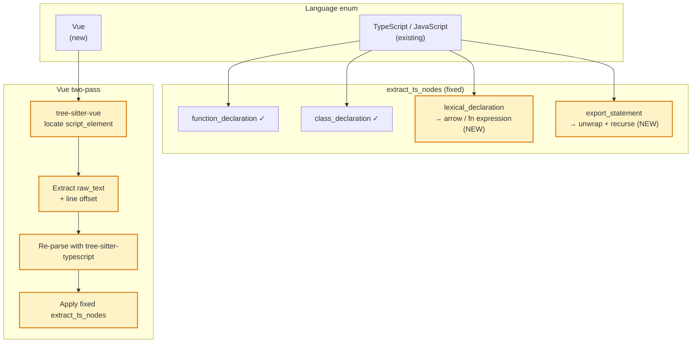

# Frontend Framework Support

> **Status**: draft · **Priority**: high · **Created**: 2026-03-20

## Overview

Ising's TypeScript/JavaScript support covers `.ts`, `.tsx`, `.js`, `.jsx` files but has two gaps that matter for real-world frontend codebases:

1. **React arrow function components are not extracted** — the current extractor only matches `function_declaration` and `class_declaration`. React codebases overwhelmingly use `const Foo = () => {}`, which appears as `lexical_declaration` in the AST and is silently skipped.

2. **Vue Single File Components (`.vue`) are not supported at all** — Vue is the second most popular frontend framework. `.vue` files contain `<script>`, `<template>`, and `<style>` blocks in a single file and cannot be parsed by the TypeScript grammar directly.

This spec fixes the React gap and adds Vue support. Angular and Svelte are assessed below.

## Framework Assessment

| Framework | File types | Current state | Action |
|---|---|---|---|
| **React** | `.tsx`, `.jsx`, `.ts`, `.js` | Partial — `function` components work, arrow components missed | Fix extractor |
| **Vue** | `.vue` | Not supported | Add `tree-sitter-vue` |
| **Angular** | `.ts`, `.html` | `.ts` files fully work; templates not analyzed | No action needed |
| **Svelte** | `.svelte` | Not supported | Deferred — grammar is unstable |
| **Solid.js** | `.tsx` | Works via existing TSX support | No action needed |
| **Astro** | `.astro` | Not supported | Deferred |

## Design

### Fix 1: React Arrow Function Components

The current extractor only walks direct children of `source_file` and matches on `function_declaration`. Arrow function components defined at the top level appear as:

```
source_file
  lexical_declaration       (const Foo = ...)
    variable_declarator
      identifier            (Foo)
      arrow_function        (() => ...)
  export_statement          (export default function Bar)
    function_declaration    (Bar)
```

Two cases to handle:

**Case A — `const Foo = () => {}`**

Walk `lexical_declaration` children. If a `variable_declarator` has an `arrow_function` or `function_expression` as its value, extract its name from the `identifier` child and treat it as a function node.

**Case B — `export default function Foo()` / `export const Foo = ...`**

Walk `export_statement` children. If the child is a `function_declaration` or `class_declaration`, extract normally. If the child is a `lexical_declaration`, apply Case A logic.

This covers the common patterns:

```typescript
const MyComponent = () => <div />          // Case A
const handler = async (e: Event) => {}     // Case A
export default function Page() {}          // Case B - function
export const getServerSideProps = async () => {} // Case B - arrow
export class MyService {}                  // Case B - class
```

### Fix 2: Vue Single File Component Support

Vue SFCs combine template, script, and style in one `.vue` file:

```vue
<template>...</template>

<script setup lang="ts">
import { ref } from 'vue'
import MyChild from './MyChild.vue'

const count = ref(0)
const handleClick = () => count.value++
</script>

<style scoped>...</style>
```

**Parsing strategy**: Use `tree-sitter-vue` to parse the `.vue` file and locate the `<script>` or `<script setup>` block. Extract the block's raw text content and re-parse it with `tree-sitter-typescript` (honoring `lang="ts"` or `lang="js"`). Apply the existing (fixed) TypeScript node extractor to the re-parsed subtree, adjusting line numbers by the script block's start line offset.

This two-pass approach avoids maintaining a full Vue grammar — the template and style blocks are ignored (they don't contribute to coupling signals), and the script content is handled by the already-validated TypeScript extractor.

**`tree-sitter-vue` grammar nodes**:

| Node kind | Purpose |
|---|---|
| `script_element` | The `<script>` or `<script setup>` block |
| `raw_text` | The text content of the script block |
| `start_tag` / `attribute` | Used to detect `lang="ts"` vs `lang="js"` |

**Import resolution for `.vue` files**:

- Relative imports: `import Foo from './Foo.vue'` → resolve `./Foo.vue` relative to current file (same as TS relative imports, but `.vue` extension must be included in module IDs)
- `@/` alias: commonly maps to `src/` in Vue projects. Resolve `@/components/Foo.vue` → `src/components/Foo.vue`. Detect by checking if `vite.config.ts` or `vue.config.js` exists in the repo root (heuristic: treat `@/` as `src/` if those files are present).

**Module IDs for Vue files**: Use the relative path including `.vue` extension, e.g., `src/components/Button.vue`. This is consistent with how TypeScript treats `.ts` files.

### Architecture



### Change Graph

Add `.vue` to `is_source_file()` in `change.rs`:

```rust
Some("py" | "ts" | "tsx" | "js" | "jsx" | "rs" | "vue")
```

(`.rs` addition is from spec 019.)

## Plan

### React Fix

- [ ] Extend `extract_ts_nodes` to handle `lexical_declaration` at top level — detect `variable_declarator` children with `arrow_function` or `function_expression` value, extract name from the declarator's `identifier`
- [ ] Extend `extract_ts_nodes` to handle `export_statement` — unwrap to inner `function_declaration`, `class_declaration`, or `lexical_declaration` and apply existing/new extraction logic
- [ ] Add complexity coverage for arrow functions (complexity already walks recursively, so this should work automatically once the node is found — verify)
- [ ] Unit test: React component file with `const Foo = () => {}`, `export default function Bar() {}`, `export const baz = async () => {}` → all three extracted as Function nodes

### Vue Support

- [ ] Add `tree-sitter-vue` to `[workspace.dependencies]` in root `Cargo.toml`
- [ ] Add `tree-sitter-vue` to `[dependencies]` in `ising-builders/Cargo.toml`
- [ ] Add `Language::Vue` variant — `from_extension("vue")`, `name()` returns `"vue"`, `get_tree_sitter_language()` returns `tree_sitter_vue::LANGUAGE.into()`
- [ ] Implement `extract_vue_nodes()` — parse with `tree-sitter-vue`, find `script_element`, extract `raw_text` content and `lang` attribute, re-parse with `tree-sitter-typescript`, apply fixed `extract_ts_nodes` with line offset adjustment
- [ ] Implement `resolve_vue_import()` — handle `.vue` relative imports and `@/` alias heuristic
- [ ] Add `"vue"` to `is_source_file()` in `change.rs`
- [ ] Unit test: `.vue` file with `<script setup lang="ts">` containing imports and arrow functions → correct nodes and import edges
- [ ] Unit test: `.vue` file with `<script>` (no lang, defaults to JS) → parsed as JavaScript
- [ ] Integration test: run `ising build` on a Vue project (e.g., Vue's own `create-vue` template output)

## Test

- [ ] `const Foo = () => {}` at file scope → `Function` node named `Foo`
- [ ] `export default function Page() {}` → `Function` node named `Page`
- [ ] `export const getServerSideProps = async () => {}` → `Function` node named `getServerSideProps`
- [ ] `export class MyService {}` → `Class` node named `MyService`
- [ ] `.vue` file with `<script setup lang="ts">` → nodes extracted from script block with correct line numbers
- [ ] `.vue` file: `import Foo from './Foo.vue'` → `Imports` edge to `path/to/Foo.vue` module node
- [ ] `.vue` file: `import { ref } from 'vue'` → no edge (external package)
- [ ] `@/components/Button.vue` in a project with `vite.config.ts` → resolves to `src/components/Button.vue`
- [ ] `is_source_file("src/App.vue")` returns `true`
- [ ] No regression: existing Python and TypeScript tests pass unchanged

## Notes

- **Why not a full Vue grammar?** The Vue template DSL (directives, interpolations, slots) does not contribute to coupling signals — it's wiring, not logic. Only the script block matters. Re-parsing the script block with the existing TypeScript extractor reuses validated logic and avoids the complexity of maintaining Vue-specific node extraction.
- **`<script setup>` vs `<script>`**: Both forms are handled identically — extract the `raw_text` content and re-parse. The Composition API used in `<script setup>` produces standard TypeScript arrow functions and `const` declarations, which the fixed extractor now handles.
- **Svelte deferred**: `tree-sitter-svelte` exists but lags the language spec. Svelte 5's rune syntax (`$state`, `$derived`) changes the AST significantly. Revisit when the grammar stabilizes.
- **Angular**: Angular components are plain TypeScript classes with decorators (`@Component`). The decorator itself is not currently extracted, but the class is. Template files (`.html`) carry no import/coupling information useful to ising. Angular is effectively already supported.
- **Line offset for Vue**: When re-parsing the script block, node line numbers from tree-sitter are relative to the script block's content, not the `.vue` file. Add the `script_element.start_position().row` offset when recording `line_start` / `line_end` on function and class nodes.
