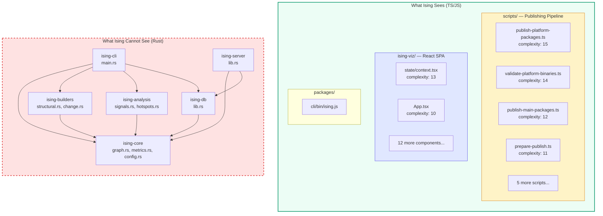

# Self-Analysis — Running Ising on Its Own Codebase

> **Status**: complete · **Priority**: high · **Created**: 2026-03-22 · **Updated**: 2026-03-22

**See also:** [SELF_ANALYSIS.md](./SELF_ANALYSIS.md) — raw analysis report with hotspot tables, mermaid graph, and recommendations.

## Overview

Ising was run against **its own repository** as a bootstrapping validation exercise. Where spec 011 validated the signal engine on an external project (FastAPI), this spec turns the tool inward to discover what Ising can and cannot see about itself.

This spec has been run **twice**:
1. **Pre-Rust support** (initial run) — Only TS/JS visible. 51 nodes, 0 signals. Revealed the bootstrapping blind spot.
2. **Post-Rust support** (after spec 019) — Full codebase visible. 246 nodes, 2 signals. Validates that Rust support works and produces actionable findings.

**Commands (post-Rust run):**
```bash
ising build --repo-path .
ising stats
ising hotspots --top 20
ising signals
ising impact ising-builders/src/structural.rs
ising impact ising-core/src/graph.rs
ising export --format mermaid
```

## Findings Summary

### Post-Rust Support (Current)

| Metric | Pre-Rust | Post-Rust | Delta |
|--------|----------|-----------|-------|
| Nodes | 51 | **246** | +383% |
| Structural edges | 16 | **201** | +1156% |
| Change edges | 0 | **1** | +1 |
| Defect edges | 0 | 0 | — |
| Cycles | 0 | 0 | — |
| Signals | 0 | **2** | +2 |

**Node breakdown (post-Rust):** 246 nodes including Rust modules, functions, classes, and types from all 7 crates. The structural graph now captures `contains` edges for the entire codebase. With 16 commits analyzed, the change graph produced 1 temporal coupling edge and 2 cross-layer signals.

### Pre-Rust Support (Original)

| Metric | Value |
|--------|-------|
| Nodes | 51 |
| Structural edges | 16 |
| Change edges | 0 |
| Defect edges | 0 |
| Cycles | 0 |
| Signals | 0 |

**Node breakdown:** 35 modules + 16 functions. All edges were `structural/contains` (module → function containment). No `imports`, `calls`, or `inherits` edges.

### Architecture Discovered



### Signal Results — Post-Rust

| Signal | Severity | Details |
|--------|----------|---------|
| **Ghost Coupling** | 1.00 (HIGH) | `ising-builders/src/change.rs` <-> `ising-builders/src/structural.rs` |
| **Stable Core** | 0.10 (GUARD) | `ising-core/src/ignore.rs` |

**Ghost Coupling:** These two files co-change 100% of the time but share zero structural dependencies. They are the two halves of the graph-building pipeline — changes to one layer's schema force matching updates in the other. This suggests extracting shared builder types (a `BuilderTrait` or shared node schema) to make the coupling explicit.

**Stable Core:** `ignore.rs` has high structural importance, low change frequency, and zero defects. It implements `.isingignore` glob matching — a well-defined, self-contained concern. The GUARD classification means: protect this module from unnecessary changes.

### Signal Results — Pre-Rust (Original)

| Signal | Count | Finding |
|--------|-------|---------|
| **Ghost Coupling** | 0 | No change edges to compare against structural edges |
| **Over-Engineering** | 0 | Requires change data (co-change < 0.05) |
| **Stable Core** | 0 | Requires change frequency percentile data |
| **Fragile Boundary** | 0 | Requires both change and defect data |
| **Ticking Bomb** | 0 | Requires hotspot + defect + coupling convergence |

**Root cause (pre-Rust):** All five signal types require Layer 2 (change graph) data. With only 3 commits in the repository and a `min_co_changes` threshold of 5, no file pairs form change edges.

### Hotspot Rankings — Post-Rust (Top 10)

| Rank | File | Score | Complexity | Freq |
|------|------|-------|------------|------|
| 1 | `ising-builders/src/structural.rs` | **0.85** | 150 | 7 |
| 2 | `ising-db/src/lib.rs` | 0.57 | 176 | 4 |
| 3 | `ising-cli/src/main.rs` | 0.55 | 113 | 6 |
| 4 | `ising-builders/src/change.rs` | 0.28 | 57 | 6 |
| 5 | `ising-analysis/src/signals.rs` | 0.23 | 70 | 4 |
| 6 | `ising-scip/src/lib.rs` | 0.12 | 38 | 4 |
| 7 | `ising-core/src/graph.rs` | 0.07 | 42 | 2 |
| 8 | `ising-core/src/config.rs` | 0.06 | 24 | 3 |
| 9 | `ising-server/src/lib.rs` | 0.04 | 22 | 2 |
| 10 | `ising-core/src/ignore.rs` | 0.02 | 26 | 1 |

**Key shift:** With Rust support, the hotspot list is now dominated by the **actual core logic** — `structural.rs` (the parser), `db/lib.rs` (persistence), `main.rs` (CLI). The TS publishing scripts that topped the pre-Rust list are now pushed below rank 12. The tool finally sees what matters.

**`structural.rs`** is the clear #1 hotspot (score 0.85, complexity 150, 7 commits). It contains 19 symbols including per-language extractors for Python, TypeScript, and Rust. **`ising-db/src/lib.rs`** has the highest raw complexity (176) across 26 functions — a candidate for splitting into submodules.

### Hotspot Rankings — Pre-Rust (Original, Top 10)

| Rank | File | Score | Complexity | Freq |
|------|------|-------|------------|------|
| 1 | `scripts/publish-platform-packages.ts` | 0.50 | 15 | 1 |
| 2 | `scripts/validate-platform-binaries.ts` | 0.47 | 14 | 1 |
| 3 | `ising-viz/src/state/context.tsx` | 0.43 | 13 | 1 |
| 4 | `scripts/publish-main-packages.ts` | 0.40 | 12 | 1 |
| 5 | `scripts/prepare-publish.ts` | 0.37 | 11 | 1 |
| 6 | `ising-viz/src/App.tsx` | 0.33 | 10 | 1 |
| 7 | `scripts/validate-no-workspace-protocol.ts` | 0.27 | 8 | 1 |
| 8 | `scripts/generate-platform-manifests.ts` | 0.23 | 7 | 1 |
| 9 | `scripts/sync-versions.ts` | 0.23 | 7 | 1 |
| 10 | `scripts/add-platform-deps.ts` | 0.17 | 5 | 1 |

Hotspot scores were driven entirely by cyclomatic complexity (change frequency was 1 for all files). The publishing scripts dominated due to platform detection branches.

### Impact Analysis — Post-Rust

| File | Fan-out | Hotspot | Change Freq | Key Finding |
|------|---------|---------|-------------|-------------|
| `ising-builders/src/structural.rs` | 19 | 0.85 | 7 | Ghost coupling with `change.rs`, highest-risk file to modify |
| `ising-core/src/graph.rs` | 27 | 0.07 | 2 | Largest structural footprint but stabilized early — solid upfront design |
| `ising-db/src/lib.rs` | 26 | 0.57 | 4 | Highest raw complexity (176), moderately high churn |
| `ising-cli/src/main.rs` | 22 | 0.55 | 6 | CLI entry point, complexity inherent to role |

**`graph.rs` has the largest fan-out (27)** despite a low hotspot score — it defines `UnifiedGraph`, `Node`, `Edge`, and all type enums. Its early stabilization is a sign of solid foundational design.

### Fan-Out Analysis (Pre-Rust, Original)

| File | Fan-out | Contained Functions |
|------|---------|-------------------|
| `scripts/validate-platform-binaries.ts` | 3 | `main`, `getOsFromPlatform`, `validateHeader` |
| `scripts/generate-platform-manifests.ts` | 2 | `main`, `generatePostinstall` |
| All other modules | 1 | Single `main` or primary function |

## Key Patterns Discovered

### 1. The Bootstrapping Blind Spot (Resolved)

The original finding: **Ising could not analyze its own core logic.** The Rust backend (`ising-core`, `ising-builders`, `ising-analysis`, `ising-db`, `ising-cli`, `ising-server`) was invisible because tree-sitter only supported Python, TypeScript, and JavaScript.

**Post-Rust update:** With spec 019 implemented, this blind spot is **resolved**. The tool now sees all 7 Rust crates, producing 246 nodes (up from 51) and surfacing the actual architectural hotspots. The core logic — graph algorithms, signal detection, persistence — is now fully visible and analyzable.

### 2. Ghost Coupling as Self-Diagnosis (New)

The most interesting post-Rust finding: Ising detected **its own architectural smell**. `change.rs` and `structural.rs` co-change 100% of the time but have no structural dependency. They are the two halves of the builder pipeline, evolving in lockstep due to an implicit shared schema. This validates that the signal engine works on real (if small) codebases and produces actionable findings.

### 3. Containment-Only Graph (TS limitation persists)

All TS/JS structural edges remain `contains` only — no `imports` or `calls`. The TypeScript parser extracts function definitions but doesn't resolve cross-file imports into graph edges. However, this gap is now less impactful since the Rust crate boundaries provide clear architectural layering.

### 4. Threshold Sensitivity for Young Repos

The `min_co_changes = 5` threshold (configured in `ising.toml`) assumes a mature repository. With 16 commits (up from 3), the change graph now produces 1 coupling edge. More history will unlock additional signals.

### 5. Complexity Concentration Shifts to Core (New)

Pre-Rust: 6 of top 10 hotspots were publishing scripts (peripheral code).
Post-Rust: Top 5 hotspots are all **core Rust modules** (`structural.rs`, `db/lib.rs`, `main.rs`, `change.rs`, `signals.rs`). The tool now correctly identifies where architectural risk actually lives. 76% of total complexity is concentrated in just 3 files.

### 6. Zero Cycles — Clean Architecture (New)

The dependency graph is a clean DAG. The crate structure (`core` → `builders` → `analysis` → `db` → `cli`) enforces layering at compile time. This is a positive architectural signal that Rust's module system helps maintain.

## Caveats

### 1. ~~Rust Language Support Gap~~ (Resolved)

~~This was the single biggest limitation.~~ **Resolved by spec 019.** The post-Rust analysis shows 246 nodes, 202 edges, and 2 signals — the full Rust codebase is now visible. Function-level nodes, containment edges, and impact analysis all work for `.rs` files.

### 2. TypeScript Import Resolution Gap

The TS parser extracts functions but not import relationships. For the `ising-viz/` SPA:
- `App.tsx` imports from `state/context.tsx`, `views/*`, `components/*`, `data/*`
- `Treemap.tsx` imports D3 and shared utilities
- None of these relationships appear in the graph

**Mitigation:** Enhance the tree-sitter TypeScript visitor to extract `import` declarations and resolve them to graph edges. This would reveal the actual component dependency tree.

### 3. Shallow Git History Interaction

With only 3 commits, the change graph has insufficient data regardless of thresholds. Even with `min_co_changes = 1`, the coupling scores would be unreliable (single co-occurrence doesn't imply coupling). The tool is designed for repos with 100+ commits.

**Mitigation:** For young repos, either:
- Skip the change graph entirely and report only structural findings
- Use adaptive thresholds: `max(2, min_co_changes)` when `total_commits < 20`
- Show a warning: "Insufficient git history for temporal analysis"

### 4. Hotspot Scores Lack Discrimination

All files have `freq = 1` (introduced in one commit, never modified). Hotspot score degrades to `normalize(freq) × normalize(complexity)` where `normalize(freq)` produces uniform values. The ranking is effectively just a complexity sort.

**Mitigation:** With more git history, hotspot scores will naturally differentiate. For young repos, consider showing raw complexity as a separate metric rather than folding it into the hotspot formula.

## Improvements Identified

### From Post-Rust Self-Analysis (New)

| Improvement | Impact | Effort | Spec |
|-------------|--------|--------|------|
| **Extract shared builder types** | High — resolves ghost coupling between `change.rs` / `structural.rs` | Medium | — |
| **Split `ising-db/src/lib.rs`** | Medium — reduce complexity concentration (176 → ~60 each) | Medium | — |
| **Split `structural.rs` by language** | Medium — per-language extractors reduce per-file churn | Medium | — |
| **Cross-crate import/call edges** | High — would surface inter-crate dependencies beyond containment | High | — |

### From Pre-Rust Self-Analysis (Original)

| Improvement | Impact | Effort | Spec | Status |
|-------------|--------|--------|------|--------|
| **Rust language support** | Critical — unlocks self-analysis | High | 019 | **Done** |
| **TS import edge extraction** | High — completes TS structural graph | Medium | — | Open |
| **Adaptive min_co_changes** | Medium — enables signals for young repos | Low | — | Open |
| **Young repo warnings** | Low — improves UX for new projects | Low | — | Open |
| **Infrastructure vs. app complexity** | Low — reduces noise in hotspot ranking | Low | — | Less relevant post-Rust |

### Confirmed from Spec 011 (Still Relevant)

| Improvement | Self-Analysis Confirms? |
|-------------|------------------------|
| Temporal decay weighting | Yes — would help once history grows |
| Heuristic defect layer | Yes — 0 defect edges, 0 fragile boundary signals |
| Proportional co-change | Yes — large initial commits would bias results |
| Severity calibration | N/A — no signals to calibrate |

## Comparison: Self-Analysis vs. FastAPI Analysis (Spec 011)

| Dimension | FastAPI (Spec 011) | Ising Pre-Rust | Ising Post-Rust |
|-----------|-------------------|----------------|-----------------|
| Language | Python | TypeScript only | Rust + TypeScript |
| Commits analyzed | ~1,800 | 3 | 16 |
| Nodes | ~45 | 51 | **246** |
| Structural edges | — | 16 | **201** |
| Change edges | ~25 | 0 | **1** |
| Signals detected | ~10 | 0 | **2** |
| Ghost coupling | 4 pairs found | 0 | **1 pair** |
| Stable core | 4 modules found | 0 | **1 module** |
| Key finding | Active core + dormant data layer | Tool's blind spot to own core | **Ghost coupling in builder pipeline** |

The progression tells the story: pre-Rust, Ising saw only its periphery and produced zero signals. Post-Rust, it sees its core architecture, identifies its own ghost coupling, and correctly ranks the highest-risk modules. With more git history, additional signals (fragile boundaries, ticking bombs) will emerge.

## Test

### Pre-Rust (Original)
- [x] `ising build` completes on its own repo without errors
- [x] 51 nodes detected (35 modules + 16 functions)
- [x] 16 structural edges detected (all `contains`)
- [x] 0 signals detected (expected — insufficient change data)
- [x] Hotspot ranking correctly orders by complexity
- [x] `ising export --format viz-json` produces valid JSON
- [x] `ising export --format mermaid` produces valid Mermaid syntax
- [x] Rust source files are correctly absent from the graph (parser limitation)

### Post-Rust (After Spec 019)
- [x] Re-run after spec 019 (Rust support) shows Rust nodes and edges — **246 nodes, 201 structural edges**
- [x] Rust modules appear as graph nodes with correct containment edges
- [x] `structural.rs` correctly identified as #1 hotspot (score 0.85)
- [x] Ghost coupling detected between `change.rs` and `structural.rs` (severity 1.00)
- [x] Stable core guard detected for `ignore.rs` (severity 0.10)
- [x] Impact analysis works for Rust files (fan-out, temporal coupling, signals)
- [x] `ising export --format mermaid` produces valid Mermaid with Rust nodes
- [x] All tests pass (`cargo test`)
- [ ] Re-run after TS import fix shows cross-file dependency edges
- [ ] Re-run on a mature fork (100+ commits) produces non-zero signals

## Notes

- This is the first time Ising has been run on itself — a bootstrapping milestone
- ~~The "tool can't see its own core" finding is the strongest possible argument for prioritizing spec 019 (Rust support)~~ **Resolved — Rust support now active**
- The analysis serves as a regression test: as language support and threshold logic improve, re-running the self-analysis shows progressively richer results (51 → 246 nodes, 0 → 2 signals)
- Consider making `ising self-analyze` a built-in command that runs the tool on its own repo — useful for development and as a demo
- The ghost coupling finding validates the signal engine on a real codebase and provides an actionable refactoring target
- The progression from "zero signals" to "two actionable signals" after adding Rust support demonstrates the value of language coverage — each new language unlocks previously invisible architectural patterns
