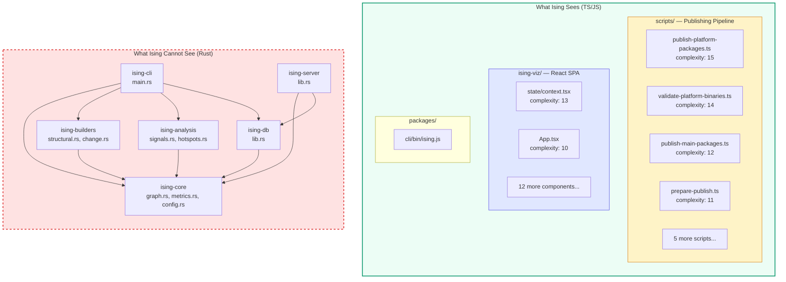

# Self-Analysis — Running Ising on Its Own Codebase

> **Status**: complete · **Priority**: high · **Created**: 2026-03-22

**See also:** [SELF_ANALYSIS.md](./SELF_ANALYSIS.md) — raw analysis report with hotspot tables, mermaid graph, and recommendations.

## Overview

Ising was run against **its own repository** as a bootstrapping validation exercise. Where spec 011 validated the signal engine on an external project (FastAPI), this spec turns the tool inward to discover what Ising can and cannot see about itself. The results reveal fundamental gaps in language coverage and threshold calibration that directly inform the roadmap.

**Command:**
```bash
ising build --repo-path . --db ising-self.db --since "3 years ago"
ising stats --db ising-self.db
ising hotspots --db ising-self.db --top 20
ising signals --db ising-self.db
ising export --db ising-self.db --format viz-json
```

## Findings Summary

### Graph Statistics

| Metric | Value |
|--------|-------|
| Nodes | 51 |
| Structural edges | 16 |
| Change edges | 0 |
| Defect edges | 0 |
| Cycles | 0 |
| Signals | 0 |

**Node breakdown:** 35 modules + 16 functions. All edges are `structural/contains` (module → function containment). No `imports`, `calls`, or `inherits` edges.

### Architecture Discovered



### Signal Results

| Signal | Count | Finding |
|--------|-------|---------|
| **Ghost Coupling** | 0 | No change edges to compare against structural edges |
| **Over-Engineering** | 0 | Requires change data (co-change < 0.05) |
| **Stable Core** | 0 | Requires change frequency percentile data |
| **Fragile Boundary** | 0 | Requires both change and defect data |
| **Ticking Bomb** | 0 | Requires hotspot + defect + coupling convergence |

**Root cause:** All five signal types require Layer 2 (change graph) data. With only 3 commits in the repository and a `min_co_changes` threshold of 5, no file pairs form change edges. The signal engine has no cross-layer data to compare.

### Hotspot Rankings (Top 10)

| Rank | File | Score | Complexity | Freq |
|------|------|-------|------------|------|
| 1 | `scripts/publish-platform-packages.ts` | 0.50 | 15 | 1 |
| 2 | `scripts/validate-platform-binaries.ts` | 0.47 | 14 | 1 |
| 3 | `ising-viz/src/state/context.tsx` | 0.43 | 13 | 1 |
| 4 | `scripts/publish-main-packages.ts` | 0.40 | 12 | 1 |
| 5 | `scripts/prepare-publish.ts` | 0.37 | 11 | 1 |
| 6 | `ising-viz/src/App.tsx` | 0.33 | 10 | 1 |
| 7 | `scripts/validate-no-workspace-protocol.ts` | 0.27 | 8 | 1 |
| 8 | `scripts/generate-platform-manifests.ts` | 0.23 | 7 | 1 |
| 9 | `scripts/sync-versions.ts` | 0.23 | 7 | 1 |
| 10 | `scripts/add-platform-deps.ts` | 0.17 | 5 | 1 |

Hotspot scores are driven entirely by cyclomatic complexity (change frequency is 1 for all files since each was introduced in a single commit). The publishing scripts dominate due to platform detection branches.

### Fan-Out Analysis

| File | Fan-out | Contained Functions |
|------|---------|-------------------|
| `scripts/validate-platform-binaries.ts` | 3 | `main`, `getOsFromPlatform`, `validateHeader` |
| `scripts/generate-platform-manifests.ts` | 2 | `main`, `generatePostinstall` |
| All other modules | 1 | Single `main` or primary function |

## Key Patterns Discovered

### 1. The Bootstrapping Blind Spot

The most important finding: **Ising cannot analyze its own core logic.** The Rust backend (`ising-core`, `ising-builders`, `ising-analysis`, `ising-db`, `ising-cli`, `ising-server`) contains ~25 `.rs` files with all the graph algorithms, signal detection, and persistence logic — but the tree-sitter structural parser only supports Python, TypeScript, and JavaScript.

This means the tool sees its **periphery** (visualization SPA, publishing scripts, npm wrapper) but is blind to its **center** (the graph engine, the signal detector, the database layer). This pattern — where the most critical code is the least instrumented — is common in real codebases and is exactly the kind of gap Ising should help teams discover.

### 2. Containment-Only Graph

All 16 structural edges are `contains` (module → function). No `imports` or `calls` edges were detected despite the TypeScript files having import statements. This reveals a gap in the TypeScript parser: it extracts function definitions but doesn't resolve cross-file imports into graph edges.

### 3. Threshold Sensitivity for Young Repos

The `min_co_changes = 5` threshold (configured in `ising.toml`) assumes a mature repository with rich git history. For a project with only 3 commits (or any young repo), this threshold ensures zero change edges are ever created. The change graph — and therefore all cross-layer signals — are effectively disabled.

### 4. Complexity Concentration in Peripheral Code

6 of the top 10 hotspots are publishing/deployment scripts, not application code. This is a common pattern: build tooling accumulates complexity through platform branching and error handling, but is rarely the source of architectural issues. A future improvement could separate "infrastructure complexity" from "application complexity" in hotspot reporting.

## Caveats

### 1. Rust Language Support Gap (Critical)

This is the single biggest limitation. Without Rust parsing:
- No structural graph for the core engine
- No function-level nodes for `graph.rs`, `metrics.rs`, `signals.rs`, etc.
- No import/call edges between crates
- Impact analysis is useless for Rust files

**Mitigation:** Spec 019 (Rust Language Support) is the direct fix. Tree-sitter has a mature Rust grammar (`tree-sitter-rust`). Once integrated, re-running the self-analysis will reveal the true architecture.

### 2. TypeScript Import Resolution Gap

The TS parser extracts functions but not import relationships. For the `ising-viz/` SPA:
- `App.tsx` imports from `state/context.tsx`, `views/*`, `components/*`, `data/*`
- `Treemap.tsx` imports D3 and shared utilities
- None of these relationships appear in the graph

**Mitigation:** Enhance the tree-sitter TypeScript visitor to extract `import` declarations and resolve them to graph edges. This would reveal the actual component dependency tree.

### 3. Shallow Git History Interaction

With only 3 commits, the change graph has insufficient data regardless of thresholds. Even with `min_co_changes = 1`, the coupling scores would be unreliable (single co-occurrence doesn't imply coupling). The tool is designed for repos with 100+ commits.

**Mitigation:** For young repos, either:
- Skip the change graph entirely and report only structural findings
- Use adaptive thresholds: `max(2, min_co_changes)` when `total_commits < 20`
- Show a warning: "Insufficient git history for temporal analysis"

### 4. Hotspot Scores Lack Discrimination

All files have `freq = 1` (introduced in one commit, never modified). Hotspot score degrades to `normalize(freq) × normalize(complexity)` where `normalize(freq)` produces uniform values. The ranking is effectively just a complexity sort.

**Mitigation:** With more git history, hotspot scores will naturally differentiate. For young repos, consider showing raw complexity as a separate metric rather than folding it into the hotspot formula.

## Improvements Identified

### From Self-Analysis (New)

| Improvement | Impact | Effort | Spec |
|-------------|--------|--------|------|
| **Rust language support** | Critical — unlocks self-analysis | High | 019 |
| **TS import edge extraction** | High — completes TS structural graph | Medium | — |
| **Adaptive min_co_changes** | Medium — enables signals for young repos | Low | — |
| **Young repo warnings** | Low — improves UX for new projects | Low | — |
| **Infrastructure vs. app complexity** | Low — reduces noise in hotspot ranking | Low | — |

### Confirmed from Spec 011 (Still Relevant)

| Improvement | Self-Analysis Confirms? |
|-------------|------------------------|
| Temporal decay weighting | Yes — would help once history grows |
| Heuristic defect layer | Yes — 0 defect edges, 0 fragile boundary signals |
| Proportional co-change | Yes — large initial commits would bias results |
| Severity calibration | N/A — no signals to calibrate |

## Comparison: Self-Analysis vs. FastAPI Analysis (Spec 011)

| Dimension | FastAPI (Spec 011) | Ising Self-Analysis |
|-----------|-------------------|-------------------|
| Language | Python | TypeScript (Rust invisible) |
| Commits analyzed | ~1,800 | 3 |
| Nodes | ~45 | 51 |
| Change edges | ~25 | 0 |
| Signals detected | ~10 | 0 |
| Ghost coupling | 4 pairs found | 0 (no change data) |
| Stable core | 4 modules found | 0 (no change data) |
| Key finding | Active core + dormant data layer | Tool's blind spot to own core |

The contrast is stark: on a mature Python repo, Ising produces rich cross-layer insights. On its own young, multi-language repo, it produces only structural complexity rankings — and only for the non-core code.

## Test

- [x] `ising build` completes on its own repo without errors
- [x] 51 nodes detected (35 modules + 16 functions)
- [x] 16 structural edges detected (all `contains`)
- [x] 0 signals detected (expected — insufficient change data)
- [x] Hotspot ranking correctly orders by complexity
- [x] `ising export --format viz-json` produces valid JSON
- [x] `ising export --format mermaid` produces valid Mermaid syntax
- [x] Rust source files are correctly absent from the graph (parser limitation)
- [ ] Re-run after spec 019 (Rust support) shows Rust nodes and edges
- [ ] Re-run after TS import fix shows cross-file dependency edges
- [ ] Re-run on a mature fork (100+ commits) produces non-zero signals

## Notes

- This is the first time Ising has been run on itself — a bootstrapping milestone
- The "tool can't see its own core" finding is the strongest possible argument for prioritizing spec 019 (Rust support)
- The analysis also serves as a regression test: as language support and threshold logic improve, re-running the self-analysis should show progressively richer results
- Consider making `ising self-analyze` a built-in command that runs the tool on its own repo — useful for development and as a demo
- The empty signal output, while uninformative, is a **true negative** — there genuinely isn't enough data for cross-layer analysis on a 3-commit repo
