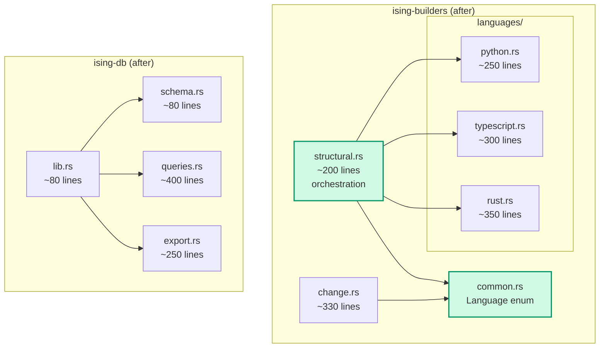

# Refactor: Builder Decomposition & DB Module Split

> **Status**: draft · **Priority**: high · **Created**: 2026-03-22

## Overview

The self-analysis report (spec 021) identified three refactoring targets through Ising's own signal detection:

1. **Ghost coupling** (severity 1.00) between `structural.rs` and `change.rs` — they co-change 100% of the time with zero structural dependency
2. **Complexity concentration** — 76% of total complexity lives in 3 files (`structural.rs` at 1088 lines, `db/lib.rs` at 886 lines, `cli/main.rs` at 594 lines)
3. **Hotspot #1** — `structural.rs` scores 0.85 (complexity 150, 7 changes), containing per-language extractors that are independent of each other

This spec addresses all three recommendations from the self-analysis, ordered by priority. The goal is to reduce coupling, distribute complexity, and make the codebase easier to extend with new languages.

## Design

### Part 1: Extract shared builder types (resolve ghost coupling)

**Root cause:** Both `structural.rs` and `change.rs` independently define "supported source file" logic. `structural.rs` has a `Language` enum with `from_extension()`, while `change.rs` has a standalone `is_source_file()` function. When a new language is added (e.g. Rust in spec 019), both files must change — hence the ghost coupling.

**Solution:** Create `ising-builders/src/common.rs` as a shared module:

```
ising-builders/src/
├── lib.rs          (orchestration — unchanged)
├── common.rs       (NEW — Language enum, shared file detection)
├── structural.rs   (imports Language from common)
└── change.rs       (imports Language from common)
```

The `Language` enum moves from `structural.rs` into `common.rs` with added methods:

```rust
// common.rs
pub enum Language {
    Python, TypeScript, JavaScript, Rust,
}

impl Language {
    pub fn from_extension(ext: &str) -> Option<Self> { ... }
    pub fn is_supported_extension(ext: &str) -> bool { ... }
    pub fn name(&self) -> &'static str { ... }
    pub fn supported_extensions() -> &'static [&'static str] { ... }
}
```

Both builders import `Language` from `common` instead of defining their own detection logic. Adding a new language becomes a single-file change to `common.rs`.

### Part 2: Split `ising-db/src/lib.rs` into submodules

**Root cause:** `lib.rs` (886 lines, complexity 176) mixes DDL schema, CRUD queries, and visualization export in one file. It's the #2 hotspot at score 0.57.

**Solution:** Split into focused submodules:

```
ising-db/src/
├── lib.rs          (Database struct, constructors, re-exports — ~80 lines)
├── schema.rs       (init_schema(), clear() — ~80 lines)
├── queries.rs      (store_graph, get_signals, get_hotspots, etc. — ~400 lines)
└── export.rs       (VizExport types, export_viz() — ~250 lines)
```

`Database` struct and its constructors (`open`, `open_in_memory`) stay in `lib.rs`. Methods are implemented across submodules using `impl Database` blocks in each file (Rust allows split impl blocks within the same crate).

### Part 3: Split `structural.rs` by language

**Root cause:** `structural.rs` (1088 lines, complexity 150, hotspot 0.85) contains per-language extractors (`extract_python_nodes`, `extract_ts_nodes`, `extract_rust_nodes`) that are independent. Adding Rust support (spec 019) required modifying this file even though it was unrelated to Python/TypeScript logic.

**Solution:** Extract per-language parsers behind a trait:

```
ising-builders/src/
├── common.rs
├── structural.rs       (orchestration + walk_source_files — ~200 lines)
├── change.rs
└── languages/
    ├── mod.rs           (LanguageExtractor trait, FileAnalysis types)
    ├── python.rs        (~250 lines)
    ├── typescript.rs    (~300 lines)
    └── rust.rs          (~350 lines)
```

The `LanguageExtractor` trait:

```rust
// languages/mod.rs
pub trait LanguageExtractor {
    fn extract(&self, source: &[u8], file_path: &str) -> Result<FileAnalysis>;
}

pub struct FileAnalysis {
    pub module_id: String,
    pub file_path: String,
    pub language: String,
    pub loc: u32,
    pub functions: Vec<FunctionInfo>,
    pub classes: Vec<ClassInfo>,
    pub imports: Vec<ImportInfo>,
}
```

`structural.rs` dispatches to the correct extractor via `Language::extractor()` and focuses solely on orchestration (file walking, graph assembly, import resolution).

### Architecture After Refactoring



## Plan

- [ ] Create `ising-builders/src/common.rs` with `Language` enum moved from `structural.rs`
- [ ] Add `is_supported_extension()` and `supported_extensions()` methods to `Language`
- [ ] Update `structural.rs` to import `Language` from `common`
- [ ] Update `change.rs` to replace `is_source_file()` with `Language::is_supported_extension()`
- [ ] Re-export `common::Language` from `ising-builders/src/lib.rs`
- [ ] Create `ising-db/src/schema.rs` — move `init_schema()` and `clear()` from `lib.rs`
- [ ] Create `ising-db/src/queries.rs` — move all `store_*` and `get_*` methods from `lib.rs`
- [ ] Create `ising-db/src/export.rs` — move `VizExport` types and `export_viz()` from `lib.rs`
- [ ] Reduce `ising-db/src/lib.rs` to struct definition, constructors, and module re-exports
- [ ] Create `ising-builders/src/languages/mod.rs` with `LanguageExtractor` trait and shared types
- [ ] Create `ising-builders/src/languages/python.rs` — move `extract_python_nodes` and complexity logic
- [ ] Create `ising-builders/src/languages/typescript.rs` — move `extract_ts_nodes` and complexity logic
- [ ] Create `ising-builders/src/languages/rust.rs` — move `extract_rust_nodes` and complexity logic
- [ ] Simplify `structural.rs` to orchestration-only (~200 lines)
- [ ] Run `cargo build` — verify compilation
- [ ] Run `cargo test` — verify all tests pass
- [ ] Run `ising build --repo-path .` — verify self-analysis produces equivalent results
- [ ] Verify ghost coupling signal disappears on re-analysis

## Test

- [ ] `cargo build` succeeds with no warnings
- [ ] `cargo test` — all existing tests pass with no regressions
- [ ] `ising build --repo-path .` produces ≥246 nodes (same or more than pre-refactor)
- [ ] `ising signals` — ghost coupling between `change.rs` and `structural.rs` is gone
- [ ] `ising hotspots` — no single file exceeds hotspot score 0.60 (complexity distributed)
- [ ] Adding a hypothetical new language requires only: new `languages/foo.rs` + `Language::Foo` variant in `common.rs`
- [ ] `structural.rs` is ≤250 lines after refactoring
- [ ] `ising-db/src/lib.rs` is ≤100 lines after refactoring
- [ ] No circular dependencies introduced (zero cycles in `ising build` output)

## Notes

- **Implementation order:** Parts 1 and 2 are independent and can be done in parallel. Part 3 depends on Part 1 (since `Language` moves to `common.rs` first).
- **Split impl blocks:** Rust allows multiple `impl Database` blocks across files within the same crate. The schema, queries, and export modules each add methods to `Database` without needing traits or wrapper types.
- **Backward compatibility:** All public APIs remain unchanged. The refactoring is purely internal — no changes to CLI commands, MCP tools, or database schema.
- **Why not a trait for Database?** Using split `impl` blocks (one per submodule) is simpler and avoids trait complexity. The `Database` type is concrete and won't have multiple implementations.
- **Validation:** Re-running `ising build --repo-path .` after refactoring serves as both a regression test and a validation that the refactoring achieved its goals (ghost coupling resolved, complexity distributed).

### Expected Metrics After Refactoring

| Metric | Before | After |
|--------|--------|-------|
| Ghost coupling signals | 1 | 0 |
| `structural.rs` lines | 1088 | ~200 |
| `ising-db/lib.rs` lines | 886 | ~80 |
| Max file complexity | 176 | ~60 |
| Files to add a new language | 2 | 1 (+enum variant) |
| Total file count (builders) | 3 | 7 |
| Total file count (db) | 1 | 4 |
