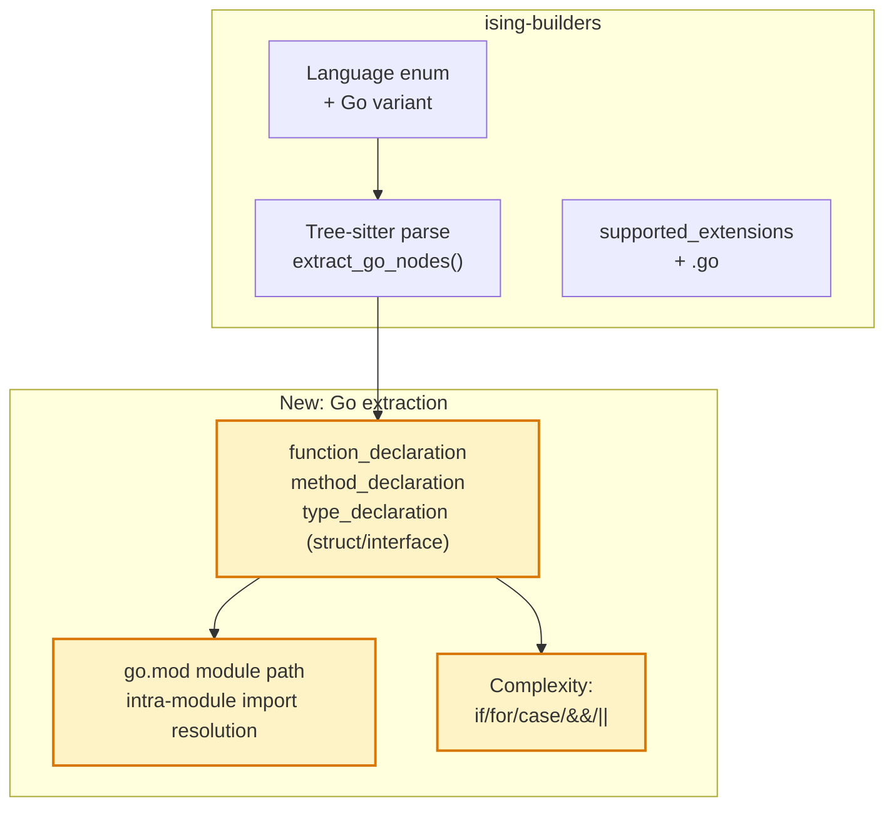

# Go Language Support

> **Status**: planned · **Priority**: high · **Created**: 2026-03-22

## Overview

Go is one of the most widely used backend languages, especially for infrastructure, microservices, and CLI tools. Ising currently supports Python, TypeScript, JavaScript, and Rust — but Go projects cannot be analyzed.

This spec adds Go support via `tree-sitter-go`. Go's simple, regular syntax maps cleanly to Ising's structural model: functions, structs (as classes), interfaces (as classes), and package-level imports.

## Design

### Layer 1: Structural Graph

#### Go-Specific Node Types

| Tree-sitter node | Ising concept | Notes |
|---|---|---|
| `function_declaration` | Function | Top-level `func` declarations |
| `method_declaration` | Function | Methods with receiver `func (s *Struct) Method()`, attributed as `StructName::Method` |
| `type_declaration` → `struct_type` | Class | `type Foo struct {}` |
| `type_declaration` → `interface_type` | Class | `type Bar interface {}` |
| `import_declaration` | Import | `import "path/to/pkg"` — intra-module only |

#### Method Attribution

Go methods declare their receiver explicitly:

```
source_file
  method_declaration
    parameter_list          (receiver: (s *MyStruct))
      parameter_declaration
        type_identifier     (MyStruct) or pointer_type → type_identifier
    identifier              (MethodName)
    block
```

Extract the receiver type name (stripping `*` for pointer receivers) and attribute methods as `file.go::MyStruct::MethodName`. This mirrors Rust's `impl` block attribution and Python's class method attribution.

#### Import Resolution

Go imports are package paths, not file paths. Two categories:

1. **Standard library** (`"fmt"`, `"net/http"`) — no node in the graph, skip.
2. **Intra-module imports** — paths matching the module's own module path (from `go.mod`). Resolution:
   - Read `go.mod` to determine the module path (e.g., `github.com/user/project`)
   - If an import starts with the module path, strip the prefix and map to a directory
   - `"github.com/user/project/internal/store"` → `internal/store/`
   - Since Go packages are directories (not files), resolve to all `.go` files in that directory, or use the directory path as the module ID

**Simplified approach**: Since Ising module IDs are file paths, treat each `.go` file as a module. For import edges, resolve intra-module package imports to the directory and create edges to all `.go` files found in that directory during graph construction.

**Relative imports**: Go does not support relative imports. All imports are absolute package paths.

#### Complexity for Go

Cyclomatic complexity decision points:

| Tree-sitter node | Reason |
|---|---|
| `if_statement` | Conditional branch |
| `for_statement` | Loop (Go has only `for`, no `while`) |
| `expression_case` | Each `case` in a `switch` |
| `type_case` | Each `case` in a type switch |
| `communication_case` | Each `case` in a `select` |
| `default_case` | Default branch in switch/select |
| `binary_expression` with `&&` / `\|\|` | Logical branching |

Base complexity = 1 + count of above.

### Layer 2: Change Graph

Add `.go` to supported file extensions in `Language::from_extension` and `supported_extensions()`.

### Architecture



## Plan

- [ ] Add `tree-sitter-go` to `[workspace.dependencies]` in root `Cargo.toml`
- [ ] Add `tree-sitter-go` to `[dependencies]` in `ising-builders/Cargo.toml`
- [ ] Add `Language::Go` variant to `Language` enum in `common.rs`
  - `from_extension`: `"go"` → `Language::Go`
  - `name()`: returns `"go"`
  - Add `"go"` to `supported_extensions()`
- [ ] Add `get_tree_sitter_language` match arm: `Language::Go` → `tree_sitter_go::LANGUAGE.into()`
- [ ] Create `ising-builders/src/languages/go.rs` with `extract_nodes()`
  - Walk `source_file` children for `function_declaration`, `method_declaration`, `type_declaration`
  - For `method_declaration`: extract receiver type from `parameter_list`, prefix method name with `ReceiverType::`
  - For `type_declaration`: check if the type spec is `struct_type` or `interface_type`, extract as Class node
  - For `import_declaration`: resolve intra-module imports via `go.mod` module path
- [ ] Implement `compute_complexity` for Go — count decision points listed above
- [ ] Add `go.rs` module to `languages/mod.rs`
- [ ] Add dispatch in `analyze_file` match arm for `Language::Go`
- [ ] Unit tests: `extract_go_nodes` on sample Go source with functions, methods, structs, interfaces
- [ ] Integration test: run `ising build` on a Go project, verify node/edge counts

## Test

- [ ] `.go` files appear in `walk_source_files` output with `Language::Go`
- [ ] `func Hello()` at file scope → `Function` node named `Hello`
- [ ] `func (s *MyStruct) Method()` → `Function` node ID `file.go::MyStruct::Method`
- [ ] `type Foo struct {}` → `Class` node named `Foo`
- [ ] `type Bar interface {}` → `Class` node named `Bar`
- [ ] Intra-module import → `Imports` edge to target package files
- [ ] `import "fmt"` → no edge added (standard library)
- [ ] Complexity: function with `if`, `for`, and `switch` with 3 cases → complexity = 1 + 1 + 1 + 3 = 6
- [ ] `Language::is_supported_file("main.go")` returns `true`
- [ ] No regression: existing Python, TypeScript, Rust tests pass unchanged

## Notes

- **Why Go next?** Go is the most popular language not yet supported. It has a simple, regular grammar that makes tree-sitter extraction straightforward. Many Go codebases are large enough to benefit from coupling analysis.
- **Package vs file granularity**: Go packages are directories containing multiple files. Ising's model is file-based. Each `.go` file becomes a module node. Import edges from file A to package P create edges to files in P's directory. This is consistent with how Ising handles Python packages.
- **`_test.go` files**: Go test files live alongside source files. They should be included in analysis — test-to-source coupling is a valid signal (e.g., tightly coupled tests may indicate fragile boundaries).
- **`init()` functions**: Go allows multiple `init()` functions per file. These should all be extracted as function nodes. Since they share the name `init`, they'll produce duplicate node IDs — deduplicate by appending a counter (e.g., `init`, `init_2`).
- **Embedded structs**: `type Foo struct { Bar }` embeds `Bar` into `Foo`. This is not an import edge — it's an intra-file composition pattern. No special handling needed.
