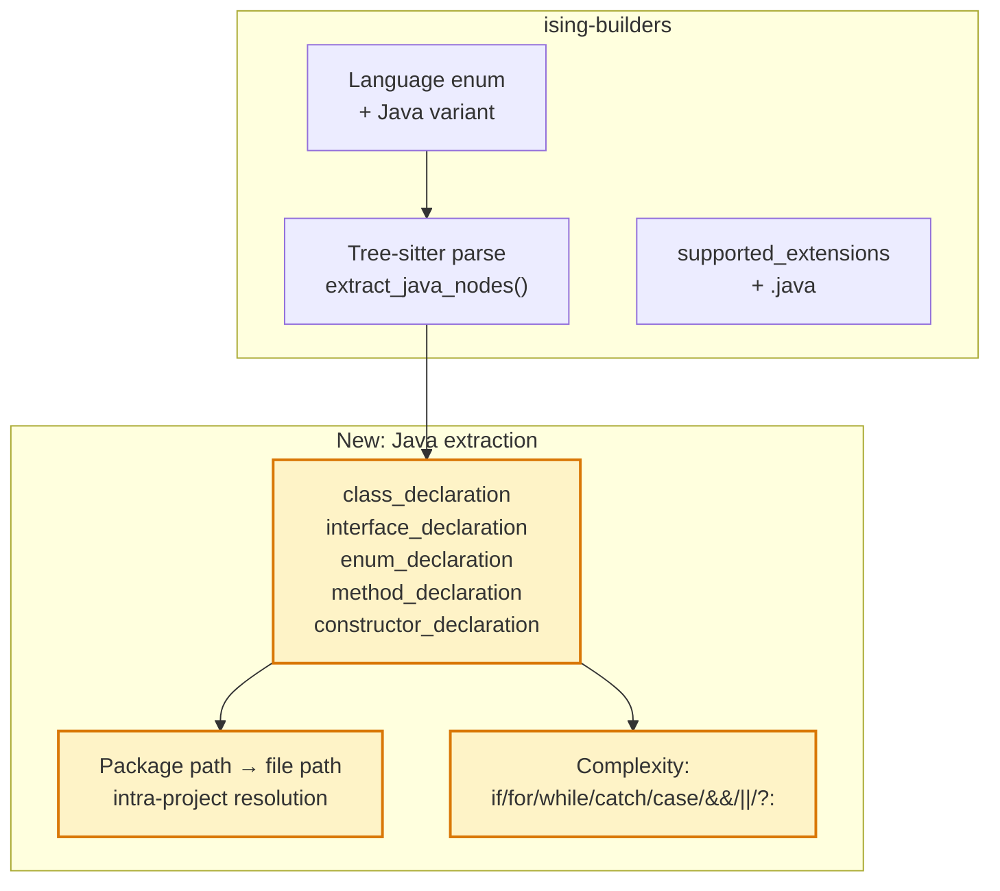

# Java Language Support

> **Status**: planned · **Priority**: high · **Created**: 2026-03-22

## Overview

Java remains one of the most widely used languages in enterprise software, Android development, and large-scale backend systems. Java codebases are often the ones that benefit most from coupling analysis — they tend to be large, long-lived, and accumulate architectural debt.

This spec adds Java support via `tree-sitter-java`. Java's class-centric structure maps directly to Ising's model: classes, methods (as functions within classes), interfaces, and package-level imports.

## Design

### Layer 1: Structural Graph

#### Java-Specific Node Types

| Tree-sitter node | Ising concept | Notes |
|---|---|---|
| `class_declaration` | Class | Top-level and nested classes |
| `interface_declaration` | Class | Interface definitions |
| `enum_declaration` | Class | Enum type definitions |
| `method_declaration` | Function | Methods inside classes, attributed as `ClassName::method` |
| `constructor_declaration` | Function | Constructors, attributed as `ClassName::ClassName` |
| `import_declaration` | Import | `import com.foo.Bar` — intra-project only |

#### Method Attribution

Java methods always live inside a class (or interface/enum). The tree-sitter structure:

```
source_file
  class_declaration
    identifier              (MyClass)
    class_body
      method_declaration
        identifier          (myMethod)
      constructor_declaration
        identifier          (MyClass)
```

All methods are attributed to their enclosing class: `File.java::MyClass::myMethod`. For nested classes, use the full nesting path: `File.java::Outer::Inner::method`.

Since Java enforces one public class per file (matching the filename), this model aligns naturally with file-based module IDs.

#### Import Resolution

Java imports are fully qualified class names:

1. **Standard library** (`java.util.*`, `javax.*`) — skip, no nodes in graph.
2. **Third-party** (`org.springframework.*`, `com.google.*`) — skip unless matches project package.
3. **Intra-project imports** — imports matching the project's base package. Resolution:
   - Detect the project's base package by scanning `src/main/java/` directory structure or reading top-level package declarations
   - Map the qualified name to a file path: `com.example.service.UserService` → `src/main/java/com/example/service/UserService.java`
   - Wildcard imports (`import com.example.model.*`) → resolve to all `.java` files in that package directory

**Simplified approach**: Convert any import path to a file path by replacing `.` with `/` and appending `.java`. Check if that path (under common source roots: `src/main/java/`, `src/`, or project root) exists as a module node. If so, add an `Imports` edge.

#### Source Roots

Java projects use conventional source directories:

| Build tool | Source root |
|---|---|
| Maven | `src/main/java/`, `src/test/java/` |
| Gradle | `src/main/java/`, `src/test/java/`, `app/src/main/java/` |
| Plain | `src/` or project root |

Detect by checking for `pom.xml` (Maven) or `build.gradle`/`build.gradle.kts` (Gradle). Fall back to scanning for `.java` files.

#### Complexity for Java

Cyclomatic complexity decision points:

| Tree-sitter node | Reason |
|---|---|
| `if_statement` | Conditional branch |
| `for_statement` | For loop |
| `enhanced_for_statement` | For-each loop |
| `while_statement` | While loop |
| `do_statement` | Do-while loop |
| `catch_clause` | Exception handler |
| `switch_expression_arm` / `switch_label` | Each case in switch |
| `binary_expression` with `&&` / `\|\|` | Logical branching |
| `ternary_expression` | Conditional expression |

Base complexity = 1 + count of above.

### Layer 2: Change Graph

Add `.java` to supported file extensions in `Language::from_extension` and `supported_extensions()`.

### Architecture



## Plan

- [ ] Add `tree-sitter-java` to `[workspace.dependencies]` in root `Cargo.toml`
- [ ] Add `tree-sitter-java` to `[dependencies]` in `ising-builders/Cargo.toml`
- [ ] Add `Language::Java` variant to `Language` enum in `common.rs`
  - `from_extension`: `"java"` → `Language::Java`
  - `name()`: returns `"java"`
  - Add `"java"` to `supported_extensions()`
- [ ] Add `get_tree_sitter_language` match arm: `Language::Java` → `tree_sitter_java::LANGUAGE.into()`
- [ ] Create `ising-builders/src/languages/java.rs` with `extract_nodes()`
  - Walk `source_file` children for `class_declaration`, `interface_declaration`, `enum_declaration`, `import_declaration`
  - For each class-like node: walk its `class_body` for `method_declaration` and `constructor_declaration`
  - Attribute methods as `ClassName::methodName`
  - Handle nested classes with full path: `Outer::Inner::method`
  - For `import_declaration`: resolve qualified name to file path
- [ ] Implement `compute_complexity` for Java — count decision points listed above
- [ ] Add `java.rs` module to `languages/mod.rs`
- [ ] Add dispatch in `analyze_file` match arm for `Language::Java`
- [ ] Implement source root detection (Maven/Gradle conventions)
- [ ] Unit tests: `extract_java_nodes` on sample Java source with classes, methods, interfaces, enums, constructors
- [ ] Integration test: run `ising build` on a Java project, verify node/edge counts

## Test

- [ ] `.java` files appear in `walk_source_files` output with `Language::Java`
- [ ] `class MyService {}` → `Class` node named `MyService`
- [ ] `interface Repository {}` → `Class` node named `Repository`
- [ ] `enum Status { ACTIVE, INACTIVE }` → `Class` node named `Status`
- [ ] `void process()` inside `MyService` → `Function` node ID `File.java::MyService::process`
- [ ] Constructor `MyService()` → `Function` node ID `File.java::MyService::MyService`
- [ ] Nested `class Inner` inside `Outer` → `Class` node `File.java::Outer::Inner`
- [ ] `import com.example.model.User;` → `Imports` edge to `src/main/java/com/example/model/User.java` (if exists)
- [ ] `import java.util.List;` → no edge added (standard library)
- [ ] `import com.example.model.*;` → edges to all `.java` files in that package (if any exist)
- [ ] Complexity: method with `if`, `for`, `catch`, and `&&` → complexity = 1 + 1 + 1 + 1 + 1 = 5
- [ ] `Language::is_supported_file("UserService.java")` returns `true`
- [ ] No regression: existing language tests pass unchanged

## Notes

- **Why Java?** Java codebases are often the largest and longest-lived in enterprise environments — exactly where coupling analysis provides the most value. Many Java projects suffer from "Big Ball of Mud" architectures that Ising's spectral analysis can quantify.
- **One class per file**: Java's convention of one public class per file makes the mapping to Ising's file-based module model natural. The class name matches the filename, so `UserService.java` contains `class UserService`.
- **Anonymous classes and lambdas**: Java 8+ lambdas appear as `lambda_expression` in tree-sitter. Anonymous classes appear as `object_creation_expression` with a `class_body`. Neither should be extracted as top-level nodes — they're implementation details within methods.
- **Annotations**: `@Override`, `@Service`, `@Component`, etc. are not extracted. They don't affect coupling signals. If future framework-aware analysis is needed (e.g., Spring dependency injection), annotations could be revisited.
- **Multi-module Maven/Gradle**: Large Java projects often have multiple modules (`module-api/`, `module-core/`, etc.). Each module has its own `src/main/java/` root. Cross-module imports will not resolve to nodes (treated like external imports). This mirrors how Rust workspace inter-crate imports are handled in spec 019.
- **Records and sealed classes**: Java 16+ records (`record Point(int x, int y)`) and sealed classes should be treated as `Class` nodes. The tree-sitter-java grammar represents records as `record_declaration` — add this to the class extraction list.
